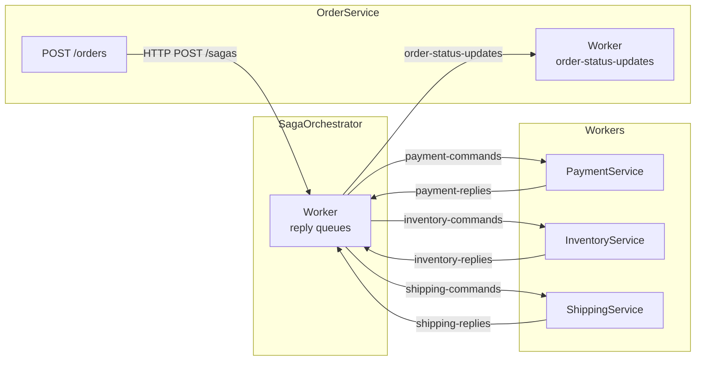

# Tasks: order-status-sync

## T1 — Constante SQS e contrato compartilhado

**Status:** pending

- Adicionar `public const string OrderStatusUpdates = "order-status-updates";` em `src/Shared/Configuration/SqsConfig.cs`
- Criar `src/Shared/Contracts/Notifications/SagaTerminatedNotification.cs`:
  ```csharp
  public record SagaTerminatedNotification(Guid SagaId, Guid OrderId, string TerminalState);
  ```
- Verificar: `dotnet build src/Shared/` compila sem erros

**Dependências:** nenhuma

---

## T2 — Criação das filas no LocalStack

**Status:** pending

- Localizar o script de inicialização de filas (ex: `infra/localstack/init-queues.sh` ou similar)
- Adicionar criação da DLQ **antes** da fila principal:
  ```bash
  awslocal sqs create-queue --queue-name order-status-updates-dlq
  awslocal sqs create-queue --queue-name order-status-updates \
    --attributes RedrivePolicy='{"deadLetterTargetArn":"arn:aws:sqs:us-east-1:000000000000:order-status-updates-dlq","maxReceiveCount":"3"}'
  ```
- Verificar: `docker compose up localstack` sobe sem erros e fila aparece em `awslocal sqs list-queues`

**Dependências:** T1

---

## T3 — Publicação da notificação no SagaOrchestrator

**Status:** pending

- Em `src/SagaOrchestrator/Worker.cs`, injetar `IAmazonSQS` (já disponível) e resolver URL de `SqsConfig.OrderStatusUpdates` no `ExecuteAsync` junto com os demais
- Criar método privado `PublishSagaTerminatedAsync(SagaInstance saga, string queueUrl, CancellationToken ct)`:
  - Instancia `SagaTerminatedNotification` com `saga.Id`, `saga.OrderId`, `saga.CurrentState.ToString()`
  - Serializa para JSON e envia via `sqs.SendMessageAsync`
- Chamar `PublishSagaTerminatedAsync` em `HandleSuccessAsync`, após `db.SaveChangesAsync`, quando `SagaStateMachine.IsTerminal(nextState)` for verdadeiro
- Chamar `PublishSagaTerminatedAsync` em `HandleCompensationReplyAsync`, após `db.SaveChangesAsync`, quando o estado final for `Failed`
- Verificar: `dotnet build src/SagaOrchestrator/` compila sem erros

**Dependências:** T1

---

## T4 — Worker no OrderService

**Status:** pending

- Criar `src/OrderService/Worker.cs` como `BackgroundService`:
  - Construtor injeta `IAmazonSQS`, `OrderDbContext`, `ILogger<Worker>`
  - `ExecuteAsync`: resolve URL de `SqsConfig.OrderStatusUpdates`, loop de long-poll (`WaitTimeSeconds=2`, `MaxNumberOfMessages=10`), `Task.WhenAll` para processar mensagens em paralelo, `Task.Delay(200)` entre iterações
  - `ProcessMessageAsync`: deserializa `SagaTerminatedNotification`, busca `Order` por `OrderId`, atualiza `Status` e `UpdatedAt`, persiste, deleta da fila; se `Order` não encontrado, loga warning e deleta
- Registrar em `src/OrderService/Program.cs`:
  ```csharp
  builder.Services.AddHostedService<Worker>();
  ```
- Registrar `IAmazonSQS` no DI do OrderService se ainda não registrado (verificar o `Program.cs` atual)
- Verificar: `dotnet build src/OrderService/` compila sem erros

**Dependências:** T1, T2

---

## T5 — Verificação end-to-end

**Status:** pending

- Subir o ambiente: `docker compose up -d`
- Executar happy path via curl:
  ```bash
  curl -s -X POST http://localhost:5001/orders \
    -H "Content-Type: application/json" \
    -d '{"totalAmount": 100, "items": [{"productId": "PROD-001", "quantity": 1}]}'
  ```
- Aguardar ~10s e consultar:
  ```bash
  curl -s http://localhost:5001/orders/{orderId}
  ```
- Verificar que `order.status` retorna `"Completed"` (não `"Processing"`)
- Executar fluxo com falha via header `X-Simulate-Failure: payment` e verificar que `order.status` retorna `"Failed"`

**Dependências:** T3, T4

---

## T6 — Atualizar SqsConfig.AllDlqNames (se aplicável)

**Status:** pending

- Verificar se `SqsConfig` contém uma lista `AllDlqNames` usada pelo endpoint `GET /dlq`
- Se sim, adicionar `"order-status-updates-dlq"` à lista e mapear `"order-status-updates-dlq"` → `"order-status-updates"` em `DlqToOriginalQueue`
- Verificar: `GET /dlq` no SagaOrchestrator inclui a nova DLQ na listagem

**Dependências:** T1

---

## T7 — Atualizar README.md

**Status:** pending

O README apresentava o fluxo incorreto: a seção "Happy Path" mostrava apenas como verificar a saga via `GET /sagas/{sagaId}`, sem mencionar que `GET /orders/{orderId}` deve refletir o status final do pedido.

Mudanças:
- Na seção "Happy Path": após o bloco de verificação da saga, adicionar verificação de `GET /orders/{orderId}` mostrando `"status": "Completed"`
- Nos cenários de falha ("Falha e Compensação"): adicionar curl de `GET /orders/{orderId}` mostrando `"status": "Failed"` após a cascata terminar
- O campo `status` na resposta do `POST /orders` já retorna `"Processing"` — não precisa mudar; o fluxo incorreto era a ausência da verificação posterior

Exemplo do bloco a adicionar no happy path:
```bash
ORDER_ID="<orderId da resposta do POST>"

# Aguardar ~3s e verificar status do pedido (atualizado pelo Worker)
curl -s http://localhost:5001/orders/$ORDER_ID | jq '{status: .status}'
```
Resposta esperada:
```json
{"status": "Completed"}
```

**Dependências:** T5 (end-to-end validado antes de documentar)

---

## T8 — Atualizar docs/08-guia-pratico.md

**Status:** pending

O guia prático apresentava o fluxo incorreto:
- Cenário 1 (Happy Path), Passo 2 (`curl http://localhost:5001/orders/{orderId}`) não mostrava a resposta esperada
- Não havia instrução para verificar que `order.status` chegou a `"Completed"` após o processamento
- Cenários de falha (Cenário 2) não mostravam `order.status = "Failed"` na verificação

Mudanças:
- **Cenário 1, Passo 2**: adicionar resposta esperada do `GET /orders/{orderId}` com `"status": "Completed"` após aguardar alguns segundos
- **Cenário 2 (falhas)**: após cada `curl POST` com `X-Simulate-Failure`, adicionar instrução de verificar `GET /orders/{orderId}` mostrando `"status": "Failed"`
- Incluir nota explicativa: "O campo `status` no pedido é atualizado de forma assíncrona pelo Worker do OrderService ao consumir a fila `order-status-updates`. Aguarde ~2s após a saga terminar."

**Dependências:** T5

---

## T9 — Atualizar testes de integração

**Status:** pending

Os testes existentes assertam apenas o estado da saga (`GET /sagas/{sagaId}`), sem verificar o status do pedido (`GET /orders/{orderId}`). Com esta feature, o `order.status` deve ser `"Completed"` ou `"Failed"` após o Worker processar a notificação.

### T9.1 — Novo DTO `OrderResponse`

Criar `tests/IntegrationTests/Models/OrderResponse.cs`:
```csharp
public record OrderResponse(
    Guid OrderId,
    Guid? SagaId,
    string Status,
    decimal TotalAmount
);
```

### T9.2 — Adicionar `GetOrderAsync` ao `SagaClient`

Em `tests/IntegrationTests/Infrastructure/SagaClient.cs`, adicionar:
```csharp
/// <summary>
/// GET /orders/{orderId} → retorna OrderResponse.
/// </summary>
public async Task<OrderResponse> GetOrderAsync(Guid orderId)
{
    var response = await _orderClient.GetAsync($"/orders/{orderId}");
    response.EnsureSuccessStatusCode();
    var body = await response.Content.ReadFromJsonAsync<JsonElement>(JsonOptions);

    return new OrderResponse(
        OrderId: body.GetProperty("orderId").GetGuid(),
        SagaId: body.TryGetProperty("sagaId", out var sid) && sid.ValueKind != JsonValueKind.Null
            ? sid.GetGuid() : null,
        Status: body.GetProperty("status").GetString() ?? string.Empty,
        TotalAmount: body.GetProperty("totalAmount").GetDecimal()
    );
}

/// <summary>
/// Faz polling até order.status atingir o valor esperado.
/// </summary>
public async Task<OrderResponse> WaitForOrderStatusAsync(
    Guid orderId,
    string expectedStatus,
    TimeSpan? timeout = null,
    TimeSpan? interval = null)
{
    var effectiveTimeout = timeout ?? TimeSpan.FromSeconds(30);
    var effectiveInterval = interval ?? TimeSpan.FromMilliseconds(500);
    using var cts = new CancellationTokenSource(effectiveTimeout);

    OrderResponse? last = null;
    while (!cts.IsCancellationRequested)
    {
        try
        {
            last = await GetOrderAsync(orderId);
            if (last.Status == expectedStatus)
                return last;
        }
        catch when (!cts.IsCancellationRequested) { }

        await Task.Delay(effectiveInterval, cts.Token).ConfigureAwait(false);
    }

    throw new TimeoutException(
        $"Order {orderId} não atingiu status '{expectedStatus}' em {effectiveTimeout.TotalSeconds}s. " +
        $"Último status: {last?.Status ?? "desconhecido"}");
}
```

### T9.3 — Atualizar `HappyPathTests`

Em `tests/IntegrationTests/Tests/HappyPathTests.cs`, após a assertion de saga `Completed`, adicionar:
```csharp
// Assert — order.status reflete estado terminal via Worker
var order = await _saga.WaitForOrderStatusAsync(orderId, "Completed");
Assert.Equal("Completed", order.Status);
```

### T9.4 — Atualizar `CompensationTests`

Em `tests/IntegrationTests/Tests/CompensationTests.cs`, em cada teste de compensação (T2, T3, T4), após a assertion de saga `Failed`, adicionar:
```csharp
// Assert — order.status reflete estado terminal via Worker
var order = await _saga.WaitForOrderStatusAsync(orderId, "Failed");
Assert.Equal("Failed", order.Status);
```

Verificar: `dotnet test tests/IntegrationTests/` compila e todos os 8 testes passam, incluindo as novas assertions.

**Dependências:** T4, T5

---

## T11 — Adicionar diagrama de arquitetura ao README.md

**Status:** pending

O README não possui representação visual da arquitetura. Adicionar um fluxograma Mermaid entre o bloco de bullet points da introdução e a seção "Pré-requisitos", mostrando os serviços, as filas SQS e o sentido do fluxo — incluindo a fila `order-status-updates` introduzida por esta feature.

O diagrama deve cobrir:
- **Fluxo forward (happy path):** `OrderService` → HTTP → `SagaOrchestrator` → `payment-commands` → `PaymentService` → `payment-replies` → `SagaOrchestrator` → `inventory-commands` → `InventoryService` → `inventory-replies` → `SagaOrchestrator` → `shipping-commands` → `ShippingService` → `shipping-replies` → `SagaOrchestrator`
- **Notificação de status:** `SagaOrchestrator` → `order-status-updates` → `OrderService` (Worker)
- **DLQs:** cada fila de comando e reply possui uma DLQ associada (representar como nó lateral ou nota para não poluir o fluxo principal)
- **PostgreSQL:** `SagaOrchestrator` e `OrderService` persistem em PostgreSQL (nó lateral)

Usar `flowchart LR` (left-to-right) com `subgraph` para agrupar os serviços. Exemplo de estrutura orientadora:

```markdown
## Arquitetura


```

Ajustar labels, DLQs e PostgreSQL até o diagrama ficar legível. O bloco deve ser inserido logo após o último bullet point da introdução e antes do `---` que precede "Pré-requisitos".

**Dependências:** T7 (o diagrama já deve incluir `order-status-updates`, portanto depende da feature estar especificada)

---

## T10 — Atualizar scripts/happy-path-demo.sh

**Status:** pending

O script verificava apenas o estado da saga via `GET /sagas/{sagaId}`, sem validar que `order.status` foi atualizado no OrderService.

Mudanças em `scripts/happy-path-demo.sh`:
- Após o poll de cada saga (`poll_saga`), adicionar chamada a uma função `assert_order_status ORDER_ID EXPECTED_STATUS`
- Implementar `assert_order_status` no próprio script (ou em `lib/common.sh`):
  ```bash
  # assert_order_status ORDER_ID EXPECTED_STATUS
  assert_order_status() {
    local order_id="$1" expected="$2" actual
    # Polling com até 15s para o Worker processar
    local deadline=$((SECONDS + 15))
    while [[ $SECONDS -lt $deadline ]]; do
      actual=$(curl -sf "$ORDER_URL/orders/$order_id" 2>/dev/null | jq -r '.status // "Unknown"')
      [[ "$actual" == "$expected" ]] && break
      sleep 1
    done
    if [[ "$actual" == "$expected" ]]; then
      cenario_ok "order.status = $expected (pedido atualizado pelo Worker)"
    else
      cenario_fail "order.status esperado $expected, obtido $actual"
    fi
  }
  ```
- **Cenário 1** (happy path): adicionar `assert_order_status "$ORDER_ID" "Completed"` após `assert_state`
- **Cenários 2, 3, 4** (falhas): adicionar `assert_order_status "$ORDER_ID" "Failed"` após `assert_state`

Verificar: o script passa com todos os `assert_order_status` validados.

**Dependências:** T5
