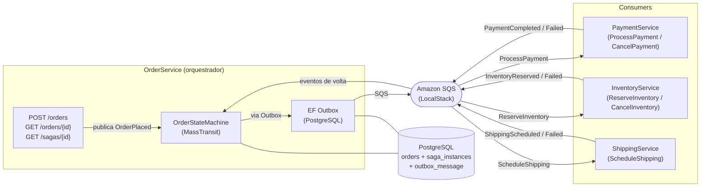

# Saga Orchestration — .NET + SQS + PostgreSQL + MassTransit

**Saga Orquestrada** em .NET 10, com **MassTransit** sobre Amazon SQS (via LocalStack) como transporte de mensagens e PostgreSQL como store de estado. O projeto demonstra, do zero ao código real, os principais padrões de sistemas distribuídos resilientes:

- **Happy path** — fluxo Order → Payment → Inventory → Shipping → `Completed`
- **Compensação em cascata** — falha em qualquer passo dispara rollback reverso automático
- **State machine declarativa** — MassTransit `MassTransitStateMachine<OrderSagaInstance>` no OrderService
- **EF Outbox** — dual-write eliminado; mensagens publicadas na mesma transação que o saga state
- **Concorrência otimista** — `xmin` (PostgreSQL) + `ConcurrencyMode.Optimistic` + retry automático
- **Deduplicação** — `DuplicateDetectionWindow` do Outbox + correlação da state machine
- **Traces distribuídos** — OpenTelemetry com `AddSource("MassTransit")`, propagado via SQS
- **Observabilidade LGTM** — traces no Grafana/Tempo, logs no Grafana/Loki, correlacionados por TraceId

## Arquitetura



**Diferença do modelo antigo:** não existe mais um serviço `SagaOrchestrator` separado nem HTTP hop entre OrderService e orquestrador. O `OrderService` absorveu a state machine — são 4 containers .NET, não 5.

---

## Pré-requisitos

| Ferramenta | Versão mínima | Verificação |
|---|---|---|
| Docker | 24+ | `docker --version` |
| Docker Compose | v2 (plugin) | `docker compose version` |
| bash | 4+ | `bash --version` |
| curl | qualquer | `curl --version` |
| jq | 1.6+ | `jq --version` |

> **Windows**: use Git Bash, WSL2 ou qualquer terminal com bash nativo para os scripts de demo.

---

## Setup Rápido

```bash
# 1. Clone o repositório
git clone https://github.com/iannkzw/saga-orchestration-dotnet-sqs.git
cd saga-orchestration-dotnet-sqs

# 2. Na primeira execução, compile as imagens antes de subir
#    (evita timeout de health check durante restauração de pacotes NuGet)
docker compose build

# 3. Suba todos os serviços
docker compose up -d

# 4. Aguarde os containers ficarem healthy (~30s)
docker compose ps
```

Saída esperada de `docker compose ps` quando tudo está pronto:

```
NAME                      STATUS
saga-lgtm                 Up (healthy)
saga-otelcol              Up
saga-localstack           Up (healthy)
saga-postgres             Up (healthy)
saga-order-service        Up (healthy)
saga-payment-service      Up (healthy)
saga-inventory-service    Up (healthy)
saga-shipping-service     Up (healthy)
```

Confirme individualmente com:

```bash
curl -s http://localhost:5001/health | jq .
```

---

## Demos

### Happy Path — saga chega a `Completed`

```bash
# Criar um pedido
curl -s -X POST http://localhost:5001/orders \
  -H "Content-Type: application/json" \
  -d '{
    "totalAmount": 99.90,
    "items": [{"productId": "PROD-001", "quantity": 1, "unitPrice": 99.90}]
  }' | jq .
```

Resposta esperada:

```json
{
  "orderId": "3fa85f64-...",
  "sagaId": "7c9e6679-...",
  "status": "Processing"
}
```

Verifique o estado da saga (aguarde ~2s para a state machine processar):

```bash
SAGA_ID="<sagaId da resposta acima>"

curl -s http://localhost:5001/sagas/$SAGA_ID | jq '{state: .state, orderId: .orderId}'
```

Resposta esperada:

```json
{
  "state": "Final",
  "orderId": "3fa85f64-..."
}
```

> **Nota:** o estado interno da state machine MassTransit termina em `"Final"`. O resultado de negócio está no campo `status` do pedido (`Completed` ou `Failed`).

Verifique o status do pedido:

```bash
ORDER_ID="<orderId da resposta do POST>"

curl -s http://localhost:5001/orders/$ORDER_ID | jq '{status: .status}'
```

Resposta esperada:

```json
{"status": "Completed"}
```

---

### Falha e Compensação — saga chega a `Failed`

Use o header `X-Simulate-Failure` para injetar falhas em qualquer passo:

#### Falha no Pagamento

```bash
curl -s -X POST http://localhost:5001/orders \
  -H "Content-Type: application/json" \
  -H "X-Simulate-Failure: payment" \
  -d '{"totalAmount": 50.00, "items": [{"productId": "PROD-001", "quantity": 1, "unitPrice": 50.00}]}' | jq .
```

Cascata: `PaymentProcessing → Failed` (nenhuma compensação necessária — nada foi confirmado)

Após a saga terminar, `GET /orders/{orderId}` retorna `"status": "Failed"`.

#### Falha no Inventário

```bash
curl -s -X POST http://localhost:5001/orders \
  -H "Content-Type: application/json" \
  -H "X-Simulate-Failure: inventory" \
  -d '{"totalAmount": 50.00, "items": [{"productId": "PROD-001", "quantity": 1, "unitPrice": 50.00}]}' | jq .
```

Cascata: `InventoryReserving → PaymentRefunding → Failed` (estorno do pagamento)

Após a saga terminar, `GET /orders/{orderId}` retorna `"status": "Failed"`.

#### Falha no Shipping

```bash
curl -s -X POST http://localhost:5001/orders \
  -H "Content-Type: application/json" \
  -H "X-Simulate-Failure: shipping" \
  -d '{"totalAmount": 50.00, "items": [{"productId": "PROD-001", "quantity": 1, "unitPrice": 50.00}]}' | jq .
```

Cascata: `ShippingScheduling → InventoryReleasing → PaymentRefunding → Failed` (rollback completo)

Após a saga terminar, `GET /orders/{orderId}` retorna `"status": "Failed"`.

---

### Script Automatizado — 4 Cenários Sequenciais

```bash
bash scripts/happy-path-demo.sh
```

O script executa e valida automaticamente:
1. Happy path completo (`Completed`)
2. Falha no pagamento (`Failed` sem compensação)
3. Falha no inventário (`Failed` com estorno de pagamento)
4. Falha no shipping (`Failed` com cascata completa)

Saída de sucesso esperada:

```
✓ Cenário 1: Happy Path — OK
✓ Cenário 2: Falha no Pagamento — OK
✓ Cenário 3: Falha no Inventário — OK
✓ Cenário 4: Falha no Shipping — OK

4/4 cenários passaram.
```

---

### Concorrência Otimista — xmin + retry automático

```bash
# COM concorrência otimista (padrão) — resultado correto: 2 Completed + 3 Failed
bash scripts/concurrent-saga-demo.sh

# SEM lock — demonstra overbooking (race condition TOCTOU)
bash scripts/concurrent-saga-demo.sh --no-lock

# Personalizar
bash scripts/concurrent-saga-demo.sh --pedidos 5 --estoque 2
```

O InventoryService usa `INVENTORY_LOCKING_MODE` para alternar entre estratégias:

| Modo | Comportamento |
|---|---|
| `pessimistic` | `SELECT FOR UPDATE` — bloqueia linha durante reserva |
| `optimistic` | Version check + retry automático (sem bloqueio) |
| `none` | Sem lock + delay 150ms — demonstra race condition TOCTOU |

O OrderService usa `ConcurrencyMode.Optimistic` com `xmin` (coluna de sistema do PostgreSQL) para proteger o saga state contra escritas concorrentes. Conflitos são absorvidos automaticamente pelo retry do MassTransit (100ms → 200ms → 500ms).

Com `INVENTORY_LOCKING_MODE=pessimistic` (padrão), o resultado esperado com estoque=2 e 5 pedidos:

```
Resultado: 2 Completed + 3 Failed
Estoque final: 0 (nenhum overbooking)
```

---

## Observabilidade — LGTM Stack

O projeto integra a stack **LGTM** (Grafana + Tempo + Loki) via um OTel Collector centralizado. Os 4 serviços .NET exportam traces e logs via OTLP gRPC para o Collector, que aplica tail sampling (descarta `GET /health` com status OK, mantém erros) e encaminha ao backend `grafana/otel-lgtm` (all-in-one).

Acesse **http://localhost:3000** após `docker compose up -d`. Use **Explore → Tempo** para buscar traces por `service.name` ou `saga.id`, e **Explore → Loki** com `{service_name="<serviço>"}` para logs. Os datasources têm link bidirecional: um `TraceID` no log navega direto ao trace, e um span no Tempo mostra os logs correlacionados.

A instrumentação do MassTransit é automática via `AddSource("MassTransit")` (registrado centralmente em `AddSagaTracing()` em `Shared/Extensions/ServiceCollectionExtensions.cs`). Cada serviço tem `OTEL_EXPORTER_OTLP_ENDPOINT=http://otelcol:4317` e `OTEL_SERVICE_NAME` em kebab-case no `docker-compose.yml`.

---

## Testes de Integração

O projeto inclui uma suíte de 10 testes de integração end-to-end que sobe o ambiente completo via Docker Compose e valida todos os cenários principais.

### Pré-requisitos

Além dos pré-requisitos gerais, é necessário o SDK .NET 10:

```bash
dotnet --version   # deve retornar 10.x
```

### Executar

```bash
dotnet test tests/IntegrationTests/
```

O runner cuida de tudo automaticamente:
1. Builda as imagens Docker (usa cache quando possível)
2. Sobe LocalStack, PostgreSQL e os 4 serviços .NET
3. Aguarda as filas SQS serem criadas e os health checks passarem
4. Executa os 10 testes em sequência
5. Derruba e limpa o ambiente (`down -v`)

Tempo esperado na primeira execução (build das imagens): **~3–5 minutos**.  
Execuções subsequentes (imagens em cache): **~1–2 minutos**.

### Testes incluídos

| ID | Classe | Cenário |
|---|---|---|
| T1 | `HappyPathTests` | Pedido válido — saga atinge `Completed` com `Order.Status=Completed` |
| T2 | `CompensationTests` | Falha no pagamento — saga termina `Failed` sem compensação |
| T3 | `CompensationTests` | Falha no inventário — `Failed` com `PaymentRefunding` |
| T4 | `CompensationTests` | Falha no shipping — `Failed` com cascata completa |
| T5a | `IdempotencyTests` | Dois pedidos simultâneos — ambos completam sem corrupção de estado |
| T5b | `IdempotencyTests` | Pedido falho não corrompe pedido bem-sucedido concorrente |
| T6 | `ConcurrencyTests` | 5 pedidos simultâneos com estoque=2 e lock pessimista — exatamente 2 completam |
| T8 | `ResilienceTests` | Resiliência via EF Outbox — LocalStack pausado 5s no meio da saga; saga completa após drain |
| T9 | `ResilienceTests` | Concorrência otimista — 10 sagas paralelas com estoque=10; todas completam via xmin retry |
| T10 | `ResilienceTests` | Deduplicação — 3 POST /orders rápidos geram 3 sagas distintas; todas completam |

### Saída esperada

```
Aprovado IntegrationTests.Tests.CompensationTests.PaymentFailure_SagaFails_NoCompensation
Aprovado IntegrationTests.Tests.CompensationTests.ShippingFailure_SagaFails_InventoryAndPaymentCompensated
Aprovado IntegrationTests.Tests.CompensationTests.InventoryFailure_SagaFails_PaymentRefunded
Aprovado IntegrationTests.Tests.ConcurrencyTests.WithPessimisticLock_ExactlyTwoComplete_NoOverbooking
Aprovado IntegrationTests.Tests.HappyPathTests.PostOrder_ValidProduct_SagaCompletes
Aprovado IntegrationTests.Tests.IdempotencyTests.TwoConcurrentOrders_BothComplete_NoStateCorruption
Aprovado IntegrationTests.Tests.IdempotencyTests.FailingOrderDoesNotCorruptConcurrentSuccessfulOrder
Aprovado IntegrationTests.Tests.ResilienceTests.OutboxDrain_LocalStackPausedMidSaga_SagaEventuallyCompletes
Aprovado IntegrationTests.Tests.ResilienceTests.OptimisticConcurrency_TenParallelSagas_AllComplete
Aprovado IntegrationTests.Tests.ResilienceTests.Deduplication_ThreeRapidOrders_ThreeDistinctSagas

Total de testes: 10 | Aprovados: 10
```

### Detalhes da infraestrutura de testes

Os testes usam um compose override (`tests/IntegrationTests/docker-compose.test.yml`) que:
- Fixa as portas 5001–5005 para os serviços
- Força `INVENTORY_LOCKING_MODE=pessimistic` (necessário para T6)
- Adiciona `restart: unless-stopped` para tolerar o race entre startup e criação assíncrona das filas SQS pelo MassTransit

---

## Estrutura do Projeto

```
saga-orchestration-dotnet-sqs/
│
├── src/                          # Código-fonte dos serviços .NET
│   ├── OrderService/             # API HTTP + state machine MassTransit + EF Outbox
│   │   ├── Api/                  # OrderEndpoints.cs, SagaEndpoints.cs
│   │   ├── Data/                 # OrderDbContext (orders + saga_instances + outbox)
│   │   ├── Migrations/           # EF Core migrations (InitialCreate, AddMassTransitOutbox, ...)
│   │   ├── Models/               # Order, OrderSagaInstance
│   │   └── StateMachine/         # OrderStateMachine, OrderStateMachineDefinition
│   ├── PaymentService/           # Consumers: ProcessPayment, CancelPayment
│   ├── InventoryService/         # Consumers: ReserveInventory, CancelInventory
│   ├── ShippingService/          # Consumer: ScheduleShipping
│   └── Shared/                   # Contracts (Events, Commands), Extensions, Telemetry
│
├── docs/                         # Documentação didática (8 artigos)
│
├── scripts/                      # Scripts bash para demos
│   ├── lib/common.sh             # Funções compartilhadas (check_health, poll_saga, etc.)
│   ├── happy-path-demo.sh        # 4 cenários sequenciais com verificação automática
│   └── concurrent-saga-demo.sh   # Demo de concorrência com/sem lock
│
├── tests/
│   └── IntegrationTests/         # Suíte de 10 testes E2E (xUnit + Docker Compose)
│       ├── Tests/                # HappyPath, Compensation, Idempotency, Concurrency, Resilience
│       ├── Infrastructure/       # DockerComposeFixture, SagaClient, InventoryClient
│       └── docker-compose.test.yml  # Override de portas e locking mode para testes
│
├── infra/                        # Configuração de infraestrutura local
│   ├── localstack/               # init-sqs.sh (no-op — MassTransit cria filas automaticamente)
│   ├── postgres/                 # init.sql (apenas extensão uuid-ossp; DDL vem das migrations)
│   ├── otel/                     # Configuração do OTel Collector
│   │   ├── otelcol.yaml          # Receivers, processors, exporters e pipelines
│   │   └── processors/sampling/  # Políticas de tail sampling (drop health checks, keep errors)
│   └── grafana/                  # Grafana provisioning automático
│       ├── provisioning/
│       │   ├── datasources/      # Datasources Tempo e Loki (com link bidirecional)
│       │   └── dashboards/       # Provider de dashboards
│       └── dashboards/           # Dashboard "Saga Orchestration — Overview" (JSON)
│
└── docker-compose.yml            # Orquestração completa do ambiente local
```

---

## Portas dos Serviços

| Serviço | Porta | Health Check |
|---|---|---|
| LocalStack (SQS) | 4566 | `curl http://localhost:4566/_localstack/health` |
| PostgreSQL | 5432 | — (acesso interno) |
| Grafana (LGTM) | 3000 | `curl http://localhost:3000/api/health` |
| OTel Collector (gRPC) | 4317 | — (ingress OTLP) |
| OTel Collector (HTTP) | 4318 | — (ingress OTLP) |
| OrderService | 5001 | `curl http://localhost:5001/health` |
| PaymentService | 5003 | `curl http://localhost:5003/health` |
| InventoryService | 5004 | `curl http://localhost:5004/health` |
| ShippingService | 5005 | `curl http://localhost:5005/health` |

Endpoints do OrderService:

```bash
POST http://localhost:5001/orders                    # Criar pedido
GET  http://localhost:5001/orders/{orderId}          # Consultar pedido (status de negócio)
GET  http://localhost:5001/sagas/{sagaId}            # Consultar saga (estado da state machine)
```

Endpoints adicionais do InventoryService:

```bash
GET  http://localhost:5004/inventory/stock/{productId}   # Consultar estoque
POST http://localhost:5004/inventory/reset               # Resetar estoque para demos
```

---

## Documentação Didática

Oito artigos em [`docs/`](docs/) que aprofundam cada padrão implementado:

| Documento | O que cobre |
|---|---|
| [01-fundamentos-sagas.md](docs/01-fundamentos-sagas.md) | Saga vs 2PC, orquestrada vs coreografada, fusão OrderService + Orchestrator |
| [02-maquina-de-estados.md](docs/02-maquina-de-estados.md) | State machine declarativa MassTransit, estados, transições forward e de compensação |
| [03-padroes-compensacao.md](docs/03-padroes-compensacao.md) | Cascata reversa, contratos tipados de compensação, implementação do rollback |
| [04-idempotencia-retry.md](docs/04-idempotencia-retry.md) | Dupla camada: correlação da state machine + DuplicateDetectionWindow do Outbox |
| [05-sqs-dlq-visibility.md](docs/05-sqs-dlq-visibility.md) | Topologia de filas MassTransit, retry policies, EF Outbox como garantia de entrega |
| [06-opentelemetry-traces.md](docs/06-opentelemetry-traces.md) | Instrumentação automática MassTransit, SagaActivitySource, exporters OTLP, stack LGTM |
| [07-concorrencia-sagas.md](docs/07-concorrencia-sagas.md) | xmin + ConcurrencyMode.Optimistic, pessimistic vs optimistic locking no InventoryService |
| [08-guia-pratico.md](docs/08-guia-pratico.md) | Passo a passo completo de todos os cenários, troubleshooting |
