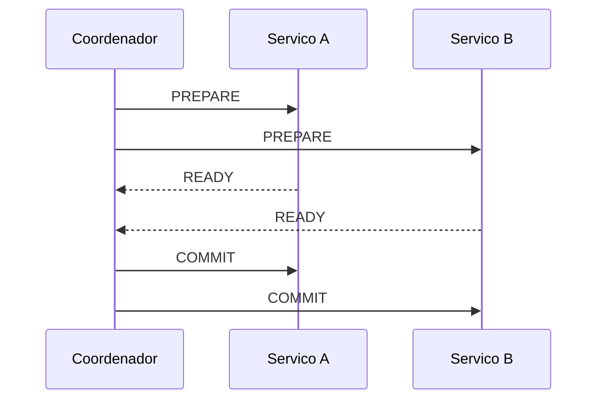
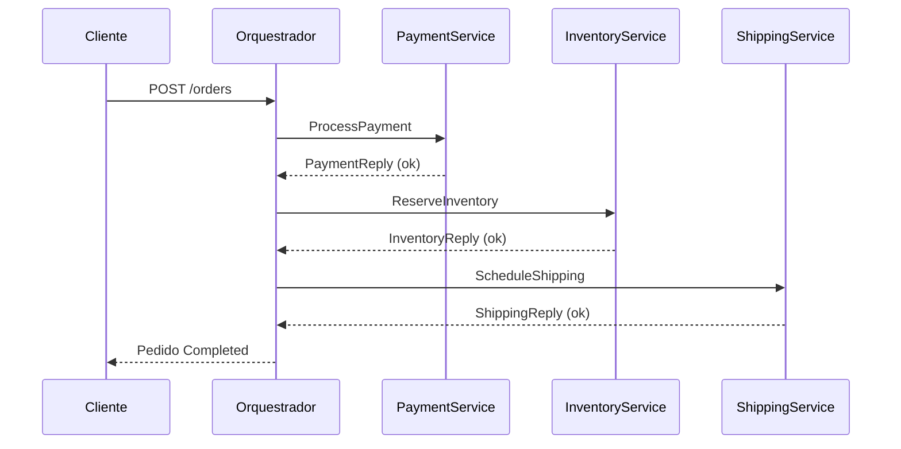
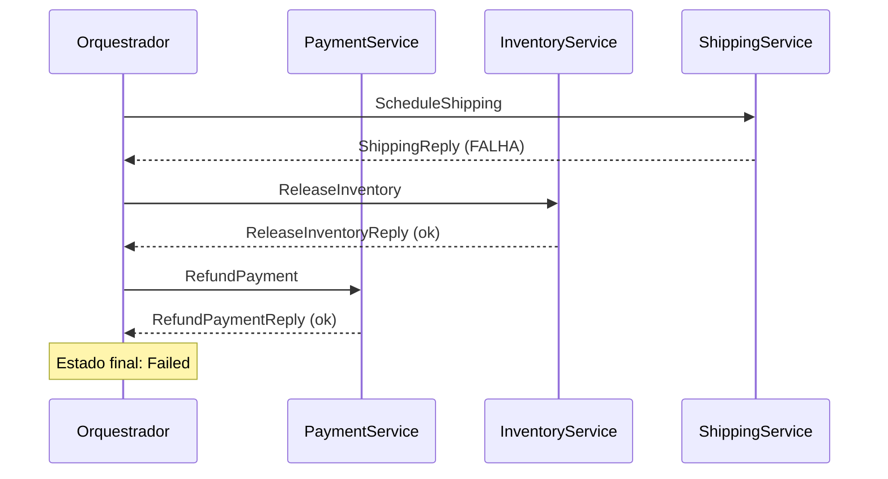
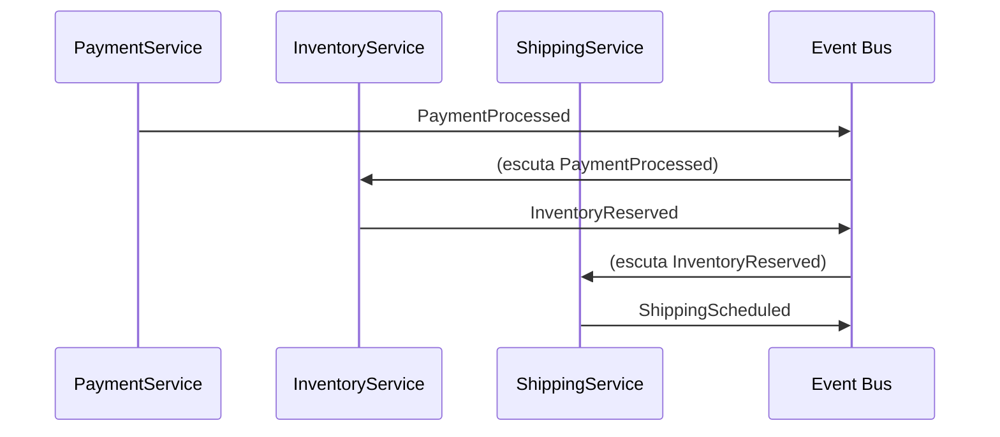
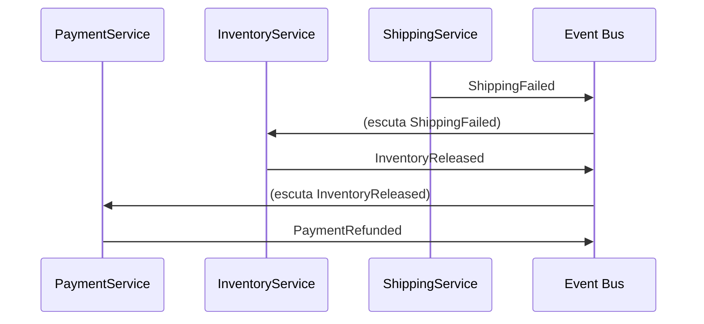
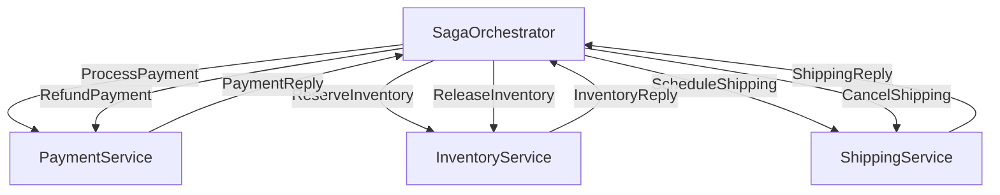

# Fundamentos de Sagas

> **Serie de documentos:** Esta documentacao faz parte de uma serie didatica sobre o padrao Saga implementado neste repositorio. Cada documento cobre um aspecto especifico do sistema, desde conceitos fundamentais ate guias praticos.

---

## O que e uma Saga?

O padrao **Saga** e uma estrategia para gerenciar transacoes de longa duracao em sistemas distribuidos. Foi proposto por Hector Garcia-Molina e Kenneth Salem em 1987 no artigo _"Sagas"_, originalmente para bancos de dados relacionais — mas ganhou enorme relevancia na era dos microservicos.

Uma Saga divide uma transacao longa em uma sequencia de transacoes menores e locais, cada uma executada em um servico diferente. Se alguma etapa falha, a Saga executa **transacoes de compensacao** para desfazer o trabalho ja realizado.

### Exemplo do mundo real

Imagine um pedido de e-commerce:

1. Cobrar o cartao do cliente
2. Reservar o produto no estoque
3. Agendar a entrega

Se o passo 3 falhar (sem entregadores disponiveis), precisamos:
- Liberar a reserva de estoque (passo 2)
- Estornar o pagamento (passo 1)

Isso e uma Saga: uma sequencia com compensacoes.

---

## Saga vs Two-Phase Commit (2PC)

### Como o 2PC funciona

O **Two-Phase Commit** e um protocolo classico para garantir atomicidade em transacoes distribuidas:

**Fase 1 (Prepare):** O coordenador pergunta a todos os participantes se estao prontos para commitar. Cada participante bloqueia os recursos necessarios e responde READY ou ABORT.

**Fase 2 (Commit/Rollback):** Se todos responderam READY, o coordenador envia COMMIT. Se qualquer um respondeu ABORT, envia ROLLBACK para todos.

### Comparacao: Saga vs 2PC

| Aspecto | Saga | Two-Phase Commit (2PC) |
|---------|------|----------------------|
| **Coordenacao** | Logica de negocio (orquestrador ou eventos) | Protocolo tecnico de consenso |
| **Bloqueio de recursos** | Nenhum (sem locks globais) | Bloqueia recursos durante toda a transacao |
| **Disponibilidade** | Alta (falhas parciais sao toleradas) | Baixa (coordenador e SPOF) |
| **Consistencia** | Eventual (compensacoes podem levar tempo) | Forte (atomicidade garantida) |
| **Acoplamento** | Baixo (servicos independentes) | Alto (todos participam do protocolo) |
| **Performance** | Alta (sem bloqueios globais) | Baixa (duas rodadas de comunicacao sincrona) |
| **Escalabilidade** | Horizontal | Limitada (coordenador e gargalo) |
| **Complexidade** | Alta na logica de compensacao | Alta no protocolo e no tratamento de falhas |
| **Tolerancia a falhas** | Boa (cada passo e independente) | Fragil (falha do coordenador trava tudo) |

### Por que 2PC nao escala em microservicos?

1. **Bloqueio de recursos:** Durante o 2PC, todos os participantes mantem locks ate o commit final. Em microservicos com alta concorrencia, isso cria gargalos severos.

2. **Acoplamento sincrono:** Todos os servicos precisam estar disponiveis simultaneamente. Uma falha temporaria em qualquer um aborta toda a transacao.

3. **Coordenador como ponto unico de falha:** Se o coordenador cair apos o PREPARE mas antes do COMMIT, os participantes ficam em estado indefinido com recursos bloqueados.

4. **Incompatibilidade com bancos heterogeneos:** Na pratica, microservicos usam bancos diferentes (PostgreSQL, MongoDB, Redis). Poucos suportam 2PC, e menos ainda de forma interoperavel.

5. **Contrario a autonomia dos servicos:** Microservicos sao projetados para serem independentes. O 2PC forcosamente cria um protocolo global que viola essa autonomia.

---

## Saga Orquestrada vs Saga Coreografada

Existem duas abordagens principais para implementar o padrao Saga:

### Saga Orquestrada

Um **orquestrador central** conhece toda a sequencia de passos e coordena ativamente cada servico. Ele envia comandos e aguarda replies.

**Compensacao orquestrada** (falha no Shipping):

### Saga Coreografada

Nao ha coordenador central. Cada servico **reage a eventos** e publica novos eventos para os proximos passos. A logica de negocio esta distribuida.

**Compensacao coreografada** (falha no Shipping):

### Comparacao: Orquestrada vs Coreografada

| Aspecto | Orquestrada | Coreografada |
|---------|-------------|--------------|
| **Controle do fluxo** | Centralizado no orquestrador | Distribuido entre servicos |
| **Visibilidade** | Alta (estado da saga em um lugar) | Baixa (estado fragmentado entre servicos) |
| **Acoplamento** | Servicos acoplados ao orquestrador | Servicos acoplados via contrato de eventos |
| **Facilidade de depuracao** | Alta (trace centralizado) | Baixa (logs distribuidos) |
| **Facilidade de modificar fluxo** | Alta (muda so o orquestrador) | Media (requer coordenacao entre times) |
| **Escalabilidade do orquestrador** | Pode ser gargalo | Sem gargalo central |
| **Complexidade de compensacao** | Explicita e controlada | Implicita e distribuida |
| **Risco de ciclos infinitos** | Baixo | Alto (eventos podem desencadear loops) |

---

## Por que Orquestracao neste Projeto?

Este projeto implementa a abordagem **orquestrada** por quatro razoes principais:

### 1. Visibilidade total do fluxo

O `SagaOrchestrator` mantem o estado completo da saga em `SagaInstance` com `CurrentState` e um historico de transicoes em `SagaStateTransition`. A qualquer momento, `GET /sagas/{id}` retorna exatamente onde a saga esta.

Em uma abordagem coreografada, seria necessario correlacionar logs de 5 servicos diferentes para entender o estado atual.

### 2. Compensacoes explicitamente controladas

A `SagaStateMachine` define explicitamente quais compensacoes executar para cada ponto de falha. A logica `_failureTransitions` mapeia diretamente `InentoryReserving → PaymentRefunding`. Nao ha ambiguidade.

### 3. Trace distribuido natural

Com um orquestrador central iniciando todos os spans de atividade, o rastreamento OpenTelemetry flui naturalmente: um unico `TraceId` conecta todo o caminho `OrderService → Orchestrator → Payment → Inventory → Shipping → Orchestrator`.

### 4. Adequacao didatica

Para um PoC educacional, a orquestracao torna o fluxo mais legivel: o `Worker.cs` do orquestrador e o "roteiro" da saga — cada reply dispara uma transicao de estado previsivel.

---

## Proxima Leitura

- [02 - Maquina de Estados da Saga](./02-maquina-de-estados.md)
- [03 - Padroes de Compensacao](./03-padroes-compensacao.md)
