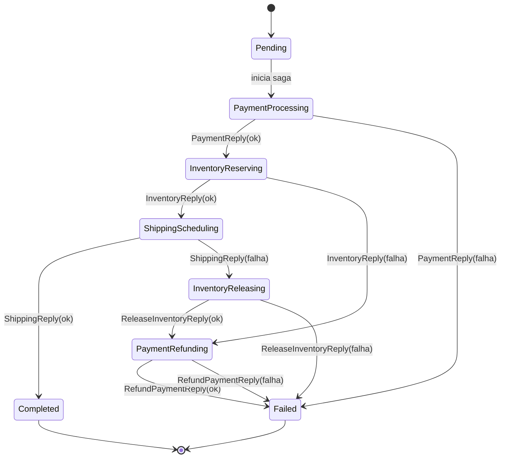
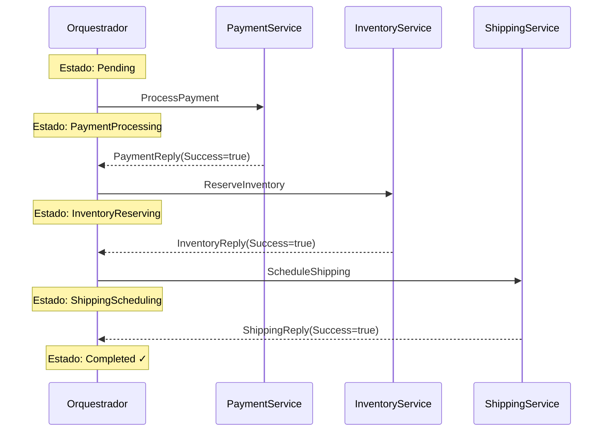
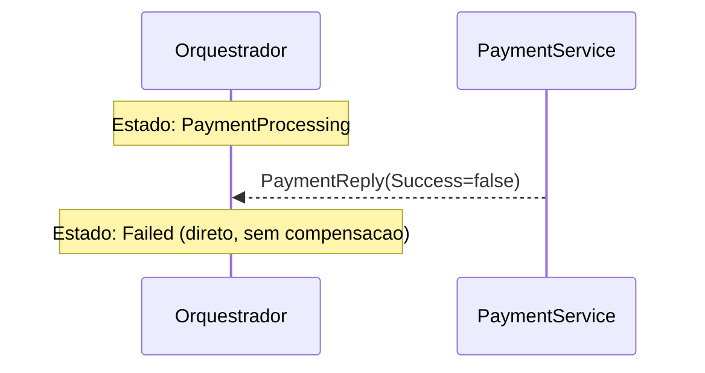
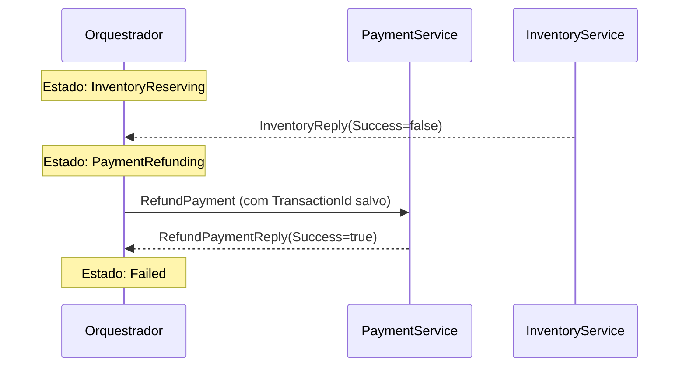
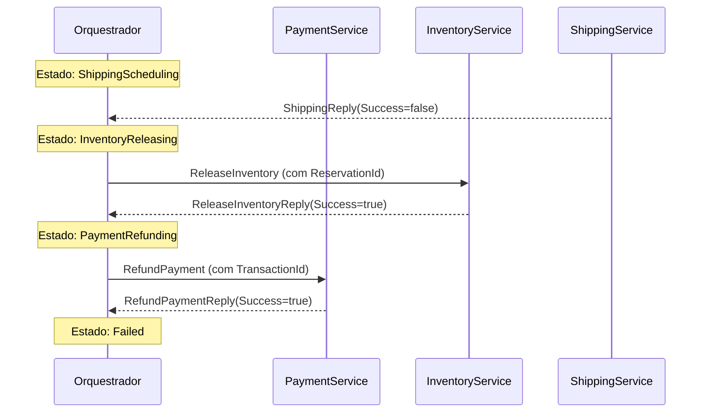

# Maquina de Estados da Saga

## O que e uma Maquina de Estados?

Uma **maquina de estados finitos** (FSM - Finite State Machine) e um modelo computacional que descreve um sistema por meio de:

- Um conjunto finito de **estados** possiveis
- Um conjunto de **transicoes** que levam de um estado para outro
- **Eventos** ou **condicoes** que disparam as transicoes

Em sagas, a maquina de estados e o "cerebro" do orquestrador: ela sabe em qual passo a saga esta, o que fazer em caso de sucesso, e o que desfazer em caso de falha.

**Por que usar FSM em Sagas?**

- Torna o fluxo explicito e auditavel
- Elimina logica condicional espalhada (evita `if/else` aninhados)
- Facilita adicionar novos passos sem quebrar os existentes
- O historico de transicoes serve como log de auditoria natural

---

## Estados da Saga

O enum `SagaState` define todos os estados possiveis:

```csharp
public enum SagaState
{
    // Estados forward (fluxo normal)
    Pending,
    PaymentProcessing,
    InventoryReserving,
    ShippingScheduling,
    Completed,

    // Estados de compensacao (fluxo reverso)
    ShippingCancelling,
    InventoryReleasing,
    PaymentRefunding,

    // Estado terminal de falha
    Failed
}
```

### Classificacao dos estados

| Categoria | Estados | Descricao |
|-----------|---------|-----------|
| **Forward** | Pending, PaymentProcessing, InventoryReserving, ShippingScheduling | Fluxo normal de avanco |
| **Terminal de sucesso** | Completed | Saga concluida com sucesso |
| **Compensacao** | ShippingCancelling, InventoryReleasing, PaymentRefunding | Desfazendo passos anteriores |
| **Terminal de falha** | Failed | Saga encerrada apos compensacoes |

---

## Diagrama Completo da Maquina de Estados



---

## Fluxo Forward (Happy Path)

Quando todos os servicos respondem com sucesso:



**Transicoes no codigo** (`SagaStateMachine.cs`):

```csharp
private static readonly Dictionary<SagaState, TransitionResult> _forwardTransitions = new()
{
    [SagaState.Pending]             = new(SagaState.PaymentProcessing, "payment-commands"),
    [SagaState.PaymentProcessing]   = new(SagaState.InventoryReserving, "inventory-commands"),
    [SagaState.InventoryReserving]  = new(SagaState.ShippingScheduling, "shipping-commands"),
    [SagaState.ShippingScheduling]  = new(SagaState.Completed, null), // null = sem proximo comando
};
```

`TransitionResult` carrega dois dados: o proximo estado (`NextState`) e a fila para onde enviar o proximo comando (`CommandQueue`). Quando `CommandQueue` e `null`, a saga chegou a um estado terminal.

---

## Fluxo de Compensacao

### Falha em PaymentProcessing

Nenhum passo anterior completou, portanto nao ha nada para compensar:



### Falha em InventoryReserving

Payment ja completou → compensar Payment:



### Falha em ShippingScheduling

Inventory e Payment ja completaram → compensar na ordem reversa:



**Transicoes de falha no codigo:**

```csharp
// O estado em que ocorreu a falha determina o primeiro passo de compensacao.
// Apenas passos que JA completaram precisam ser compensados.
private static readonly Dictionary<SagaState, TransitionResult> _failureTransitions = new()
{
    // Payment falhou → nada completou antes → Failed direto
    [SagaState.PaymentProcessing]  = new(SagaState.Failed, null),
    // Inventory falhou → Payment completou → compensar Payment
    [SagaState.InventoryReserving] = new(SagaState.PaymentRefunding, "payment-commands"),
    // Shipping falhou → Inventory+Payment completaram → compensar Inventory primeiro
    [SagaState.ShippingScheduling] = new(SagaState.InventoryReleasing, "inventory-commands"),
};
```

---

## Implementacao: Design da SagaStateMachine

A `SagaStateMachine` e uma **classe estatica pura** — sem estado interno, sem dependencias, sem side effects. Ela e apenas logica de transicao:

```csharp
public static class SagaStateMachine
{
    // Avanca no fluxo forward (chamado em respostas de sucesso)
    public static TransitionResult? TryAdvance(SagaState currentState)
        => _forwardTransitions.GetValueOrDefault(currentState);

    // Determina a primeira compensacao com base no ponto de falha
    public static TransitionResult? TryCompensate(SagaState failedState)
        => _failureTransitions.GetValueOrDefault(failedState);

    // Avanca na cascata de compensacao
    public static TransitionResult? TryAdvanceCompensation(SagaState currentCompensationState)
        => _compensationTransitions.GetValueOrDefault(currentCompensationState);

    // True para Completed e Failed (sem mais transicoes)
    public static bool IsTerminal(SagaState state)
        => state == SagaState.Completed || state == SagaState.Failed;

    // True para ShippingCancelling, InventoryReleasing, PaymentRefunding
    public static bool IsCompensating(SagaState state)
        => state is SagaState.ShippingCancelling or SagaState.InventoryReleasing or SagaState.PaymentRefunding;
}
```

**Por que classe estatica pura?**

- Totalmente testavel sem mocks ou DI
- Imutavel: transicoes sao definidas em dicionarios `readonly` em tempo de compilacao
- Sem side effects: o orquestrador decide o que fazer com o resultado — a maquina apenas computa o proximo estado

---

## Persistencia da Saga

### SagaInstance

```csharp
public class SagaInstance
{
    public Guid Id { get; set; }
    public Guid OrderId { get; set; }
    public SagaState CurrentState { get; set; } = SagaState.Pending;
    public decimal TotalAmount { get; set; }
    public string ItemsJson { get; set; } = "[]";
    public string CompensationDataJson { get; set; } = "{}"; // TransactionId, ReservationId, TrackingNumber
    public string? SimulateFailure { get; set; }
    public DateTime CreatedAt { get; set; }
    public DateTime UpdatedAt { get; set; }

    public List<SagaStateTransition> Transitions { get; set; } = [];

    // Cria a transicao, atualiza CurrentState, adiciona ao historico
    public SagaStateTransition TransitionTo(SagaState newState, string triggeredBy) { ... }
}
```

### SagaStateTransition (Audit Trail)

Cada transicao de estado gera um registro imutavel:

```
Id           | SagaId | FromState          | ToState           | TriggeredBy         | Timestamp
-------------|--------|--------------------|--------------------|---------------------|----------
uuid-1       | saga-1 | Pending            | PaymentProcessing  | StartSaga           | 2026-01-15T10:00:00
uuid-2       | saga-1 | PaymentProcessing  | InventoryReserving | PaymentReplies      | 2026-01-15T10:00:01
uuid-3       | saga-1 | InventoryReserving | ShippingScheduling | InventoryReplies    | 2026-01-15T10:00:02
uuid-4       | saga-1 | ShippingScheduling | Completed          | ShippingReplies     | 2026-01-15T10:00:03
```

Esse historico permite reconstruir exatamente o que aconteceu em cada saga — essencial para debugging e auditoria.

---

## Como o Worker usa a StateMachine

O `Worker.cs` do orquestrador e o "motor de execucao" da maquina de estados:

```
Recebe reply da fila SQS
        ↓
  IsCompensating?
   /          \
  Sim         Nao
   ↓           ↓
HandleCompen  Success?
sationReply   /    \
            Sim    Nao
             ↓      ↓
         HandleSuc HandleFai
         cessAsync  lureAsync
              ↓         ↓
          TryAdvance  TryCompen
                       sate
              ↓         ↓
         Envia proxi  Envia pri
         mo comando   meiro comp
```

---

## Proxima Leitura

- [03 - Padroes de Compensacao](./03-padroes-compensacao.md)
- [04 - Idempotencia e Retry](./04-idempotencia-retry.md)
