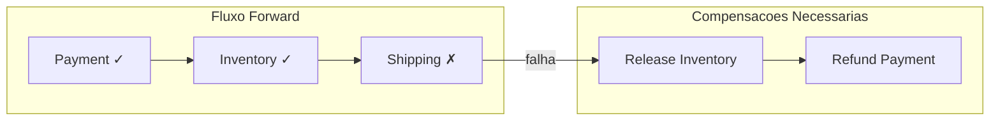
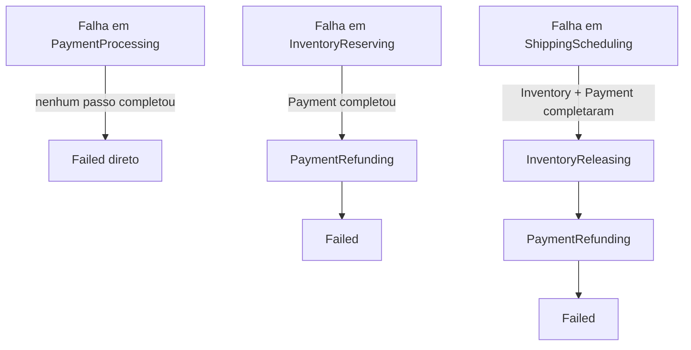

# Padroes de Compensacao

## O que e Compensacao?

Em sistemas distribuidos com sagas, **compensacao** e o ato de desfazer semanticamente o efeito de uma operacao que ja foi concluida com sucesso.

A palavra-chave aqui e **semanticamente**: compensacao nao e um rollback tecnico de banco de dados. E uma nova transacao de negocio que reverte o efeito da anterior.

### Exemplos do mundo real

| Operacao original | Compensacao |
|-------------------|-------------|
| Cobranca no cartao | Estorno |
| Reserva de hotel | Cancelamento com reembolso |
| Reserva de estoque | Liberacao do estoque |
| Agendamento de entrega | Cancelamento do agendamento |
| Emissao de nota fiscal | Nota fiscal de cancelamento (carta de correcao) |

Em todos esses casos, a operacao original **ja aconteceu** — ela nao pode ser "desfeita" tecnicamente. Criamos uma nova operacao que neutraliza o efeito.

---

## Compensacao vs Rollback

Esta e uma das confusoes mais comuns ao aprender sobre sagas:

| Caracteristica | Rollback (ACID) | Compensacao (Saga) |
|----------------|-----------------|---------------------|
| **Quando ocorre** | Antes do commit | Apos o commit (operacao ja efetivada) |
| **Mecanismo** | Desfaz a transacao no banco | Cria uma nova transacao de negocio |
| **Visibilidade externa** | Nenhuma (transparente) | Visivel externamente (estorno aparece no extrato) |
| **Garantia** | Atomicidade absoluta | Eventual consistency |
| **Possibilidade de falha** | Apenas por falha tecnica grave | Pode falhar por regra de negocio |
| **Quem executa** | O banco de dados | O servico responsavel |

**Conclusao:** Rollback e uma propriedade tecnica do banco. Compensacao e logica de negocio.

---

## Cascata de Compensacao

Quando uma etapa da saga falha, as compensacoes sao executadas **na ordem inversa** das operacoes concluidas.

### Principio: apenas compensar o que completou

O passo que **falhou** nao precisa de compensacao — ele nao gerou efeito. So compensamos os passos que **completaram com sucesso antes** do ponto de falha.



### Os tres cenarios de falha



### Mapeamento no codigo

```csharp
// SagaStateMachine.cs
private static readonly Dictionary<SagaState, TransitionResult> _failureTransitions = new()
{
    // Payment falhou: nada completou antes → vai direto para Failed
    [SagaState.PaymentProcessing]  = new(SagaState.Failed, null),

    // Inventory falhou: Payment completou → compensar Payment
    [SagaState.InventoryReserving] = new(SagaState.PaymentRefunding, "payment-commands"),

    // Shipping falhou: Inventory+Payment completaram → compensar Inventory primeiro
    [SagaState.ShippingScheduling] = new(SagaState.InventoryReleasing, "inventory-commands"),
};

// Cascata de compensacoes (apos cada compensacao bem-sucedida)
private static readonly Dictionary<SagaState, TransitionResult> _compensationTransitions = new()
{
    [SagaState.ShippingCancelling] = new(SagaState.InventoryReleasing, "inventory-commands"),
    [SagaState.InventoryReleasing] = new(SagaState.PaymentRefunding, "payment-commands"),
    [SagaState.PaymentRefunding]   = new(SagaState.Failed, null), // fim da cascata
};
```

---

## CompensationDataJson: Preservando Contexto para Compensar

Para compensar uma operacao, frequentemente precisamos de dados gerados **durante** essa operacao. Por exemplo, para estornar um pagamento, precisamos do `TransactionId` gerado pelo gateway de pagamento.

### Como os dados sao acumulados

A cada resposta de sucesso, o orquestrador extrai e armazena os dados relevantes em `CompensationDataJson`:

```csharp
// Worker.cs - StoreCompensationData
private void StoreCompensationData(SagaInstance saga, JsonElement replyJson)
{
    var data = JsonSerializer.Deserialize<Dictionary<string, string>>(saga.CompensationDataJson)
        ?? new Dictionary<string, string>();

    switch (saga.CurrentState)
    {
        case SagaState.PaymentProcessing when replyJson.TryGetProperty("TransactionId", out var tid):
            data["TransactionId"] = tid.GetString() ?? string.Empty;
            break;
        case SagaState.InventoryReserving when replyJson.TryGetProperty("ReservationId", out var rid):
            data["ReservationId"] = rid.GetString() ?? string.Empty;
            break;
        case SagaState.ShippingScheduling when replyJson.TryGetProperty("TrackingNumber", out var tn):
            data["TrackingNumber"] = tn.GetString() ?? string.Empty;
            break;
    }

    saga.CompensationDataJson = JsonSerializer.Serialize(data);
}
```

### Evolucao do CompensationDataJson durante a saga

| Momento | CompensationDataJson |
|---------|---------------------|
| Apos Payment | `{"TransactionId": "TXN-abc123"}` |
| Apos Inventory | `{"TransactionId": "TXN-abc123", "ReservationId": "RES-xyz789"}` |
| Apos Shipping | `{"TransactionId": "TXN-abc123", "ReservationId": "RES-xyz789", "TrackingNumber": "TRK-456"}` |

Se o Shipping falhar, o orquestrador tem todos os dados necessarios para compensar Inventory (`ReservationId`) e Payment (`TransactionId`).

---

## Implementacao no Worker.cs

O fluxo de compensacao no orquestrador e dividido em tres metodos:

### 1. HandleFailureAsync — Detecta a falha e inicia compensacao

```csharp
private async Task HandleFailureAsync(SagaInstance saga, ...)
{
    // Determina qual e a primeira compensacao com base no estado atual
    var result = SagaStateMachine.TryCompensate(saga.CurrentState);

    if (result is null)
    {
        // Nao ha compensacao definida (ex: falha em Payment)
        saga.TransitionTo(SagaState.Failed, ...);
        return;
    }

    // Transiciona para o primeiro estado de compensacao
    saga.TransitionTo(result.NextState, ...);

    // Envia o comando de compensacao
    if (result.CommandQueue is not null)
        await SendCompensationCommandAsync(saga, result.CommandQueue, ct);
}
```

### 2. HandleCompensationReplyAsync — Avanca na cascata

```csharp
private async Task HandleCompensationReplyAsync(SagaInstance saga, bool success, ...)
{
    if (!success)
    {
        // Compensacao falhou → estado Failed, intervencao manual
        _logger.LogError("Falha na compensacao da saga {SagaId}. Intervencao manual necessaria.");
        saga.TransitionTo(SagaState.Failed, ...);
        return;
    }

    // Compensacao bem-sucedida → avanca para a proxima na cascata
    var result = SagaStateMachine.TryAdvanceCompensation(saga.CurrentState);
    saga.TransitionTo(result.NextState, ...);

    if (result.CommandQueue is not null)
        await SendCompensationCommandAsync(saga, result.CommandQueue, ct);
    // Se CommandQueue == null: cascata concluida, saga em estado Failed
}
```

### 3. SendCompensationCommandAsync — Monta o comando de compensacao

```csharp
private async Task SendCompensationCommandAsync(SagaInstance saga, string commandQueue, CancellationToken ct)
{
    var compData = GetCompensationData(saga); // Le CompensationDataJson

    object command = saga.CurrentState switch
    {
        SagaState.PaymentRefunding => new RefundPayment
        {
            TransactionId = compData["TransactionId"],
            IdempotencyKey = $"{saga.Id}-refund-payment",
            // ...
        },
        SagaState.InventoryReleasing => new ReleaseInventory
        {
            ReservationId = compData["ReservationId"],
            IdempotencyKey = $"{saga.Id}-release-inventory",
            // ...
        },
        SagaState.ShippingCancelling => new CancelShipping
        {
            TrackingNumber = compData["TrackingNumber"],
            IdempotencyKey = $"{saga.Id}-cancel-shipping",
            // ...
        },
    };

    await SendCommandToQueueAsync(command, commandQueue, null, ct);
}
```

---

## Simulacao de Falha

Para testar cenarios de compensacao sem esperar por falhas reais, o projeto usa o header `X-Simulate-Failure`:

```bash
curl -X POST http://localhost:5001/orders \
  -H "Content-Type: application/json" \
  -H "X-Simulate-Failure: shipping" \
  -d '{"productId": "PROD-001", "quantity": 1, "price": 99.90}'
```

Valores validos: `payment`, `inventory`, `shipping`.

O header e propagado como `MessageAttribute["SimulateFailure"]` em todos os comandos da saga. Cada worker verifica esse atributo e simula uma resposta de falha quando o valor corresponde ao seu servico.

---

## E quando a Compensacao Falha?

Este e o cenario mais desafiador em sistemas distribuidos. Neste projeto, a abordagem atual e:

1. **Registrar o erro** com `LogError` — alta prioridade no sistema de monitoramento
2. **Marcar a saga como Failed** — estado final, sem retry automatico
3. **Exigir intervencao manual** — operador analisa o estado e decide como proceder

```csharp
if (!success)
{
    _logger.LogError(
        "Falha na compensacao da saga {SagaId} no estado {State}. Intervencao manual necessaria.",
        saga.Id, saga.CurrentState);
    saga.TransitionTo(SagaState.Failed, $"{mapping.ReplyTypeName}:CompensationFailure");
    await db.SaveChangesAsync(ct);
    return;
}
```

### Alternativas para sistemas de producao

| Estrategia | Descricao | Quando usar |
|------------|-----------|-------------|
| **Retry com backoff** | Tentar compensar novamente com espera crescente | Falhas transitorias (timeout, indisponibilidade temporaria) |
| **Dead Letter Queue** | Mover para DLQ para reprocessamento manual | Falhas que precisam de analise humana |
| **Human workflow** | Abrir ticket automatico para equipe de operacoes | Falhas que afetam dados financeiros |
| **Saga de compensacao** | Saga separada responsavel apenas por compensar | Sistemas de alta disponibilidade |

---

## Proxima Leitura

- [04 - Idempotencia e Retry](./04-idempotencia-retry.md)
- [05 - SQS, DLQ e Visibility Timeout](./05-sqs-dlq-visibility.md)
