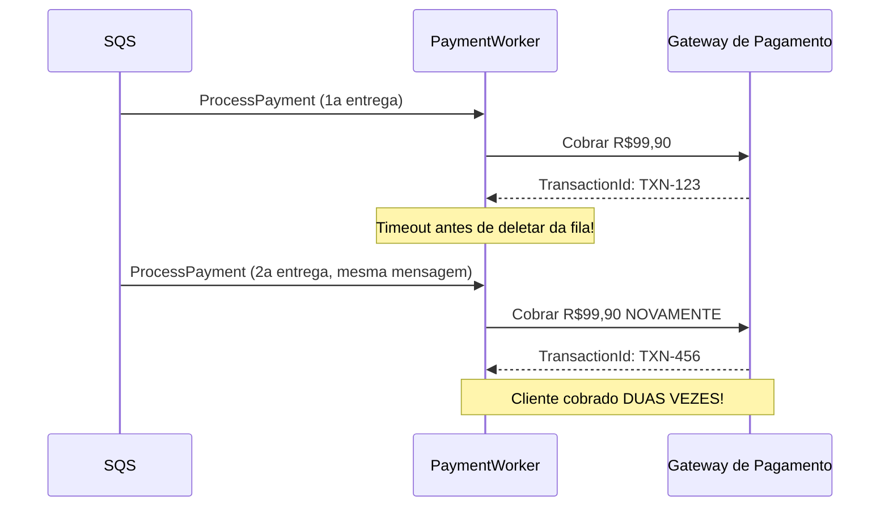
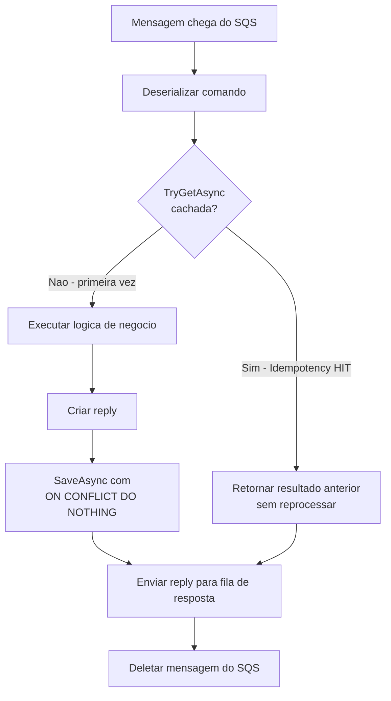
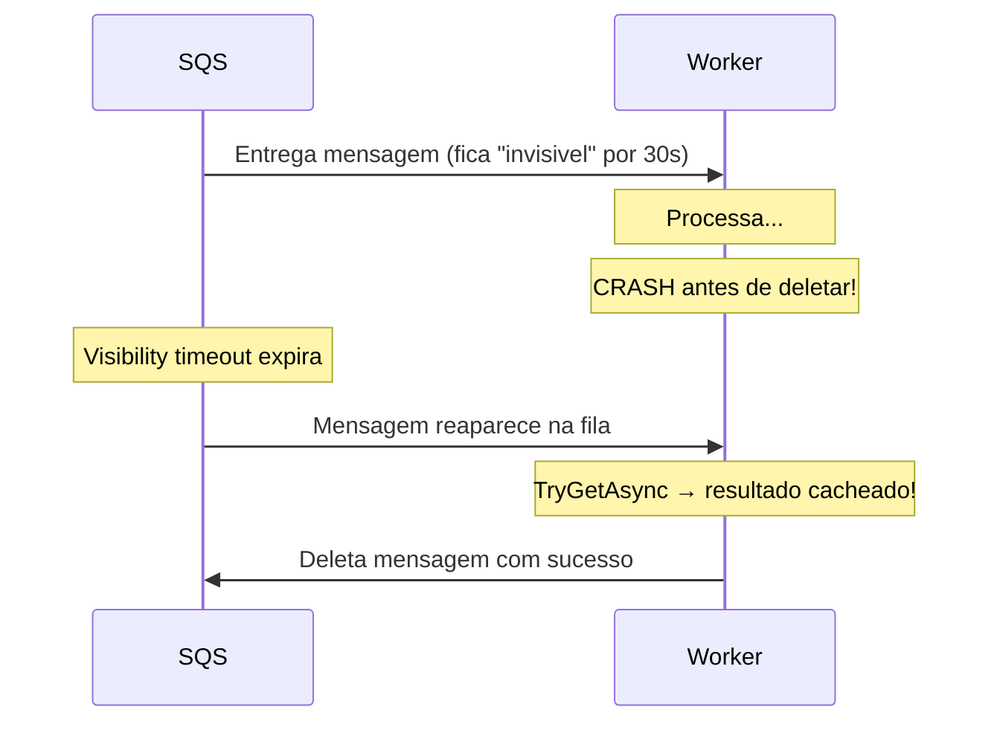

# Idempotencia e Retry

## Por que Idempotencia e Essencial?

O Amazon SQS opera com garantia de **at-least-once delivery** (entrega pelo menos uma vez). Isso significa que uma mensagem **pode ser entregue mais de uma vez**.

Isso nao e um bug — e uma caracteristica intencional de sistemas de mensageria distribuida. A alternativa (exactly-once delivery) exige coordenacao pesada que prejudica disponibilidade e throughput.

### O problema sem idempotencia



Sem idempotencia, um simples timeout pode causar cobranças duplicadas, reservas duplicadas, ou outros efeitos indesejaveis.

---

## O que e uma Operacao Idempotente?

Uma operacao e **idempotente** se aplicar ela multiplas vezes produz o mesmo resultado que aplicar uma unica vez:

```
f(x) = f(f(x)) = f(f(f(x))) = ...
```

Exemplos do cotidiano:
- `DELETE /resource/123` — deletar algo que ja foi deletado nao muda o resultado
- `PUT /user/profile` — atualizar com os mesmos dados e equivalente a uma unica atualizacao
- Pressionar o botao de fechar uma janela ja fechada — nenhum efeito adicional

**Operacoes naturalmente idempotentes:** leituras (`GET`), upserts com chave primaria, atualizacoes para um valor fixo.

**Operacoes que precisam de idempotencia explicita:** cobranças, envios de email, reservas, qualquer operacao que incrementa ou cria novos registros.

---

## Estrategias de Idempotencia

| Estrategia | Como funciona | Pros | Contras |
|------------|---------------|------|---------|
| **Chave de idempotencia** (usada aqui) | Salva o resultado por chave unica; replays retornam o resultado salvo | Simples, flexivel, funciona para qualquer operacao | Requer armazenamento persistente |
| **Idempotencia natural** | Redesenhar a operacao para ser idempotente por natureza (ex: upsert) | Zero overhead | Nem sempre e possivel |
| **Deduplicacao no broker** | SQS FIFO com MessageDeduplicationId | Nao requer codigo na aplicacao | Limitado a 5 minutos, exige fila FIFO |
| **Chave unica no banco** | Unique constraint para detectar duplicatas | Simples para operacoes de escrita | Depende do tipo de operacao |

---

## Implementacao no Projeto

### Estrutura do banco de dados

A tabela `idempotency_keys` e criada automaticamente no startup:

```sql
CREATE TABLE IF NOT EXISTS idempotency_keys (
    idempotency_key VARCHAR(256) PRIMARY KEY,  -- chave unica por operacao
    saga_id         UUID NOT NULL,              -- referencia a saga
    result_json     TEXT NOT NULL,              -- resultado serializado em JSON
    created_at      TIMESTAMP NOT NULL DEFAULT NOW()
);

CREATE INDEX IF NOT EXISTS idx_idempotency_saga_id ON idempotency_keys (saga_id);
```

### IdempotencyStore

Implementado com **Npgsql direto** (sem EF Core) para maximo controle sobre o comportamento:

```csharp
// Verificar se ja foi processado
public async Task<T?> TryGetAsync<T>(string idempotencyKey) where T : class
{
    // SELECT result_json FROM idempotency_keys WHERE idempotency_key = @key
    var result = await cmd.ExecuteScalarAsync();
    if (result is null or DBNull) return null;

    _logger.LogInformation("Idempotency hit: chave {Key} ja processada", idempotencyKey);
    return JsonSerializer.Deserialize<T>((string)result);
}

// Salvar resultado (sem falhar se ja existir)
public async Task SaveAsync<T>(string idempotencyKey, Guid sagaId, T result)
{
    // INSERT INTO idempotency_keys ... ON CONFLICT (idempotency_key) DO NOTHING
    // ON CONFLICT DO NOTHING: race condition entre dois workers? O segundo simplesmente nao insere.
    await cmd.ExecuteNonQueryAsync();
}
```

**Por que `ON CONFLICT DO NOTHING`?**

Se dois workers receberem a mesma mensagem simultaneamente (cenario raro mas possivel), ambos passariam no `TryGetAsync` (ainda nao ha registro) e tentariam inserir. O segundo `INSERT` com `ON CONFLICT DO NOTHING` simplesmente e ignorado — sem excecao, sem estado inconsistente.

---

## Geracao da Chave de Idempotencia

A chave e gerada pelo **orquestrador** e incluida no comando antes de ser enviado para a fila:

```csharp
// Worker.cs do SagaOrchestrator
SagaState.InventoryReserving => new ReserveInventory
{
    SagaId = saga.Id,
    IdempotencyKey = $"{saga.Id}-inventory",  // formato: {sagaId}-{stepName}
    // ...
},
```

### Todas as chaves geradas por saga

| Passo | IdempotencyKey |
|-------|----------------|
| ProcessPayment | `{sagaId}-payment` |
| ReserveInventory | `{sagaId}-inventory` |
| ScheduleShipping | `{sagaId}-shipping` |
| RefundPayment | `{sagaId}-refund-payment` |
| ReleaseInventory | `{sagaId}-release-inventory` |
| CancelShipping | `{sagaId}-cancel-shipping` |

**Por que esse padrao funciona?**
- A `sagaId` e globalmente unica (UUID v4)
- O sufixo garante que cada passo tem sua propria chave
- Mesma saga sendo reprocessada (redrive de DLQ) gera a **mesma chave** → idempotencia garantida
- Saga diferente (novo pedido) gera uma `sagaId` diferente → chaves diferentes → processamento independente

---

## Fluxo Completo com Idempotencia



### No codigo do PaymentService Worker

```csharp
private async Task HandleProcessPaymentAsync(ProcessPayment command, CancellationToken ct)
{
    // 1. Verificar idempotencia
    var cachedReply = await _idempotencyStore.TryGetAsync<PaymentReply>(command.IdempotencyKey);
    if (cachedReply is not null)
    {
        _logger.LogInformation("Idempotency hit para ProcessPayment IdempotencyKey={Key}", command.IdempotencyKey);
        await SendReplyAsync(cachedReply, ct); // envia o resultado anterior
        return;                                // sai sem reprocessar
    }

    // 2. Processar o comando (logica de negocio real)
    await Task.Delay(200, ct); // simula processamento
    var reply = new PaymentReply
    {
        SagaId = command.SagaId,
        Success = true,
        TransactionId = $"TXN-{Guid.NewGuid():N}"
    };

    // 3. Salvar resultado para futuras deduplicacoes
    await _idempotencyStore.SaveAsync(command.IdempotencyKey, command.SagaId, reply);

    // 4. Enviar reply
    await SendReplyAsync(reply, ct);
}
```

---

## Idempotencia em Compensacoes

Compensacoes tambem sao idempotentes. Um estorno executado duas vezes seria tao danoso quanto uma cobrança duplicada.

As chaves de compensacao seguem o mesmo padrao:

```csharp
// Worker.cs - SendCompensationCommandAsync
SagaState.PaymentRefunding => new RefundPayment
{
    IdempotencyKey = $"{saga.Id}-refund-payment",  // sempre a mesma chave para esta saga
    TransactionId = compData["TransactionId"],
    // ...
},
```

Se a mensagem `RefundPayment` for entregue duas vezes (ex: timeout no worker apos processar mas antes de deletar a mensagem), a segunda execucao encontrara o resultado no `IdempotencyStore` e simplesmente reenviara o reply anterior — sem chamar o gateway de pagamento novamente.

---

## Retry e Visibility Timeout no SQS

O mecanismo de retry do SQS funciona em conjunto com a idempotencia:



### O que e Visibility Timeout?

Quando um worker recebe uma mensagem, ela fica **invisivel** para outros consumers por um periodo configurado (visibility timeout). Se o worker:
- **Deletar a mensagem** antes do timeout expirar: processamento bem-sucedido
- **Nao deletar** (crash, timeout): a mensagem reaparece na fila e pode ser recebida novamente

Sem idempotencia, esse reprocessamento causaria duplicatas. Com idempotencia, e transparente — o resultado ja esta cacheado.

### maxReceiveCount e DLQ

Apos `maxReceiveCount` tentativas fracassadas (configurado como 3 neste projeto), a mensagem e automaticamente movida para a DLQ. Ver [05 - SQS, DLQ e Visibility Timeout](./05-sqs-dlq-visibility.md) para detalhes.

---

## Proxima Leitura

- [05 - SQS, DLQ e Visibility Timeout](./05-sqs-dlq-visibility.md)
- [06 - OpenTelemetry e Traces Distribuidos](./06-opentelemetry-traces.md)
