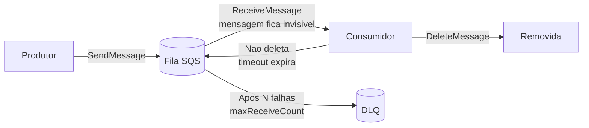
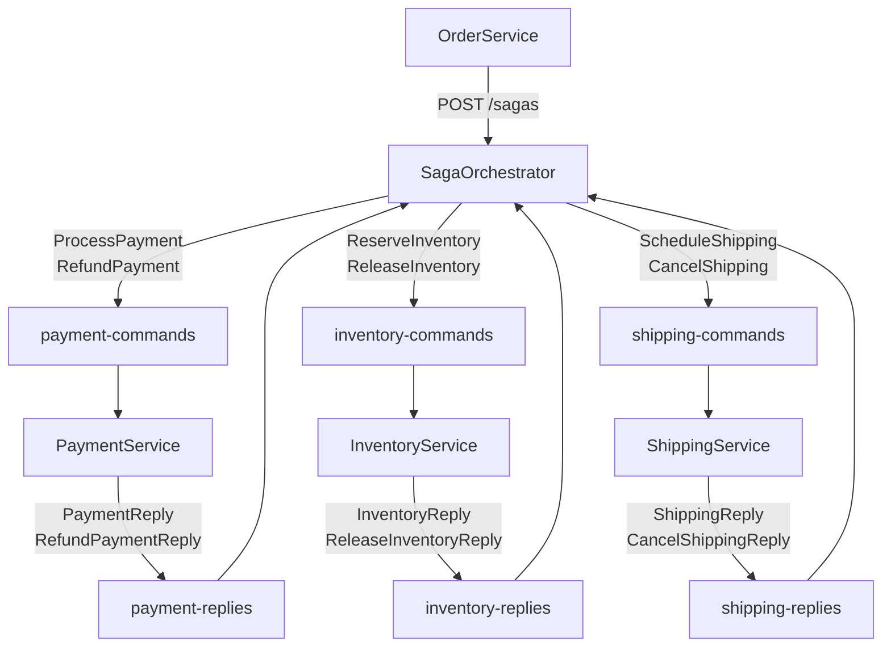
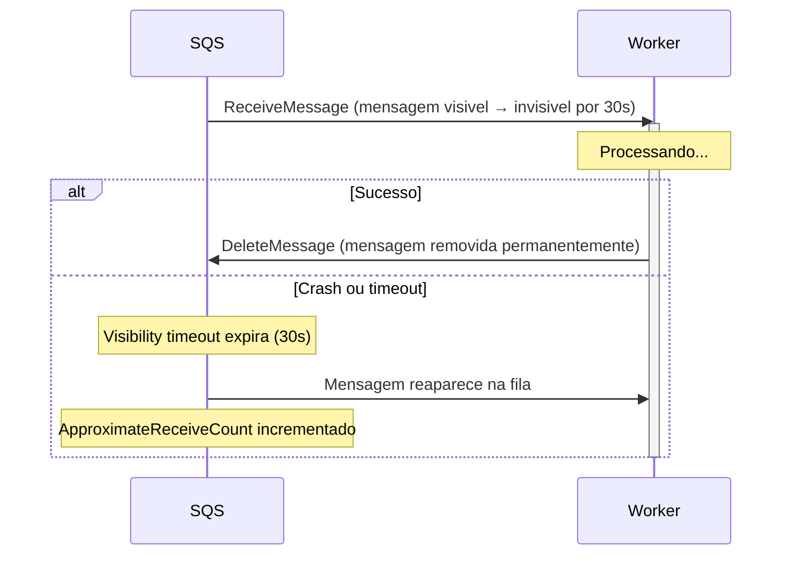
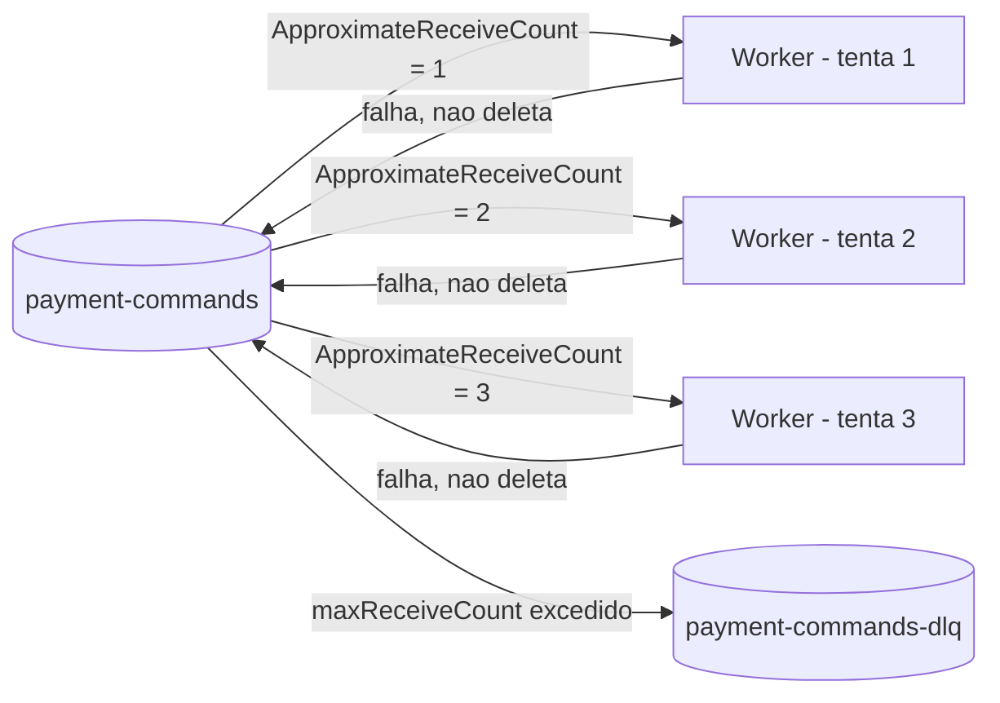
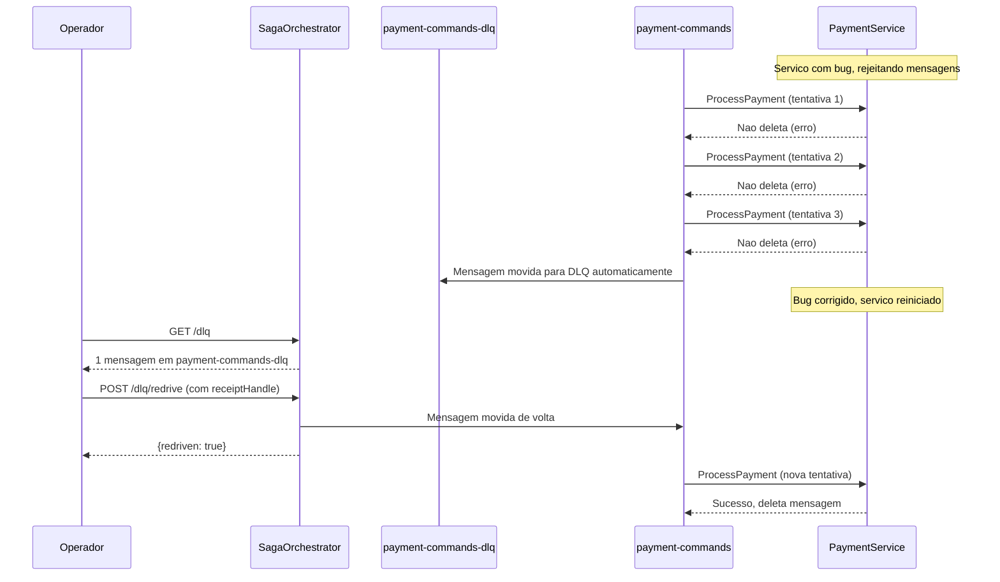

# SQS, DLQ e Visibility Timeout

## Amazon SQS: Conceitos Fundamentais

O **Amazon Simple Queue Service (SQS)** e um servico de filas de mensagens totalmente gerenciado. Ele desacopla produtores de consumidores, garantindo que mensagens sejam entregues mesmo que os servicos estejam temporariamente indisponiveis.

### Tipos de fila

| Tipo | Ordenacao | Throughput | Deduplicacao | Uso neste projeto |
|------|-----------|------------|--------------|-------------------|
| **Standard** | Best-effort | Quase ilimitado | Manual (at-least-once) | Sim |
| **FIFO** | Garantida | Ate 3.000/s | Automatica (exactly-once) | Nao |

Este projeto usa filas **Standard** — maior throughput, com idempotencia manual para lidar com duplicatas (ver [04 - Idempotencia e Retry](./04-idempotencia-retry.md)).

### Ciclo de vida de uma mensagem



---

## Topologia de Filas neste Projeto

O projeto usa **8 filas principais** + **8 DLQs** correspondentes:



### Todas as filas

| Fila | Producida por | Consumida por | Proposito |
|------|---------------|---------------|-----------|
| `payment-commands` | SagaOrchestrator | PaymentService | Comandos forward e compensacao de pagamento |
| `payment-replies` | PaymentService | SagaOrchestrator | Respostas do PaymentService |
| `inventory-commands` | SagaOrchestrator | InventoryService | Comandos forward e compensacao de estoque |
| `inventory-replies` | InventoryService | SagaOrchestrator | Respostas do InventoryService |
| `shipping-commands` | SagaOrchestrator | ShippingService | Comandos forward e compensacao de entrega |
| `shipping-replies` | ShippingService | SagaOrchestrator | Respostas do ShippingService |
| `order-commands` | OrderService | SagaOrchestrator | Inicializacao de sagas |
| `saga-commands` | — | — | Reservado para uso futuro |

---

## Visibility Timeout

O **Visibility Timeout** e o mecanismo central de retry do SQS. Quando um consumidor recebe uma mensagem, ela se torna **invisivel** para outros consumers pelo periodo configurado.



### Por que isso funciona como retry automatico?

Sem nenhum codigo adicional, o SQS ja oferece retry automatico:

1. Worker recebe mensagem e começa a processar
2. Servico externo retorna timeout
3. Worker crasha antes de deletar a mensagem
4. Apos o visibility timeout, a mensagem reaparece
5. Outro worker (ou o mesmo, ao reiniciar) processa novamente

Combinado com **idempotencia**, esse retry e completamente seguro.

---

## Dead Letter Queue (DLQ)

Uma **Dead Letter Queue** e uma fila especial que recebe mensagens que falharam muitas vezes. E a rede de seguranca do sistema: mensagens problematicas sao isoladas automaticamente, sem bloquear o processamento das demais.

### RedrivePolicy

Cada fila principal tem uma `RedrivePolicy` que define:
- `deadLetterTargetArn`: o ARN da DLQ de destino
- `maxReceiveCount`: quantas vezes a mensagem pode ser recebida antes de ir para a DLQ



### Configuracao no LocalStack (`init-sqs.sh`)

```bash
create_queue_with_dlq() {
  local QUEUE_NAME=$1

  # 1. Criar a DLQ primeiro
  awslocal sqs create-queue --queue-name "${QUEUE_NAME}-dlq"

  # 2. Obter o ARN da DLQ
  DLQ_ARN=$(awslocal sqs get-queue-attributes \
    --queue-url "${QUEUE_BASE_URL}/${QUEUE_NAME}-dlq" \
    --attribute-names QueueArn --query 'Attributes.QueueArn' --output text)

  # 3. Criar fila principal com RedrivePolicy apontando para a DLQ
  awslocal sqs create-queue \
    --queue-name "${QUEUE_NAME}" \
    --attributes "{\"RedrivePolicy\":\"{
      \\\"deadLetterTargetArn\\\":\\\"$DLQ_ARN\\\",
      \\\"maxReceiveCount\\\":\\\"3\\\"
    }\"}"
}

# Cria 8 pares (fila + DLQ)
for QUEUE in order-commands payment-commands payment-replies \
             inventory-commands inventory-replies \
             shipping-commands shipping-replies saga-commands; do
  create_queue_with_dlq "$QUEUE"
done
```

---

## Endpoints de Visibilidade das DLQs

O `SagaOrchestrator` expoe dois endpoints para inspecao e recuperacao de mensagens nas DLQs.

### GET /dlq — Listar mensagens em todas as DLQs

Faz um **peek** nao destrutivo (VisibilityTimeout=0) em todas as 8 DLQs:

```bash
curl http://localhost:5002/dlq
```

Resposta:

```json
{
  "payment-commands-dlq": {
    "count": 1,
    "messages": [
      {
        "messageId": "abc-123",
        "receiptHandle": "AQEBwJnK...",
        "body": {
          "SagaId": "550e8400-e29b-41d4-a716-446655440000",
          "CommandType": "ProcessPayment",
          "Amount": 99.90
        },
        "approximateReceiveCount": "4",
        "sentTimestamp": "1706000000000"
      }
    ]
  },
  "inventory-commands-dlq": {
    "count": 0,
    "messages": []
  }
}
```

**Importante:** `VisibilityTimeout=0` no peek significa que a mensagem nao fica invisivel — ela aparece na resposta mas permanece disponivel na fila. E uma leitura sem efeitos colaterais.

### POST /dlq/redrive — Reprocessar uma mensagem

Move uma mensagem especifica da DLQ de volta para a fila original:

```bash
curl -X POST http://localhost:5002/dlq/redrive \
  -H "Content-Type: application/json" \
  -d '{
    "queueName": "payment-commands-dlq",
    "receiptHandle": "AQEBwJnK..."
  }'
```

Resposta:

```json
{
  "redriven": true,
  "fromDlq": "payment-commands-dlq",
  "toQueue": "payment-commands",
  "messageId": "abc-123"
}
```

O mapeamento DLQ → fila original e feito pelo `SqsConfig`:

```csharp
// SqsConfig.cs
public static readonly Dictionary<string, string> DlqToOriginalQueue = AllDlqNames
    .ToDictionary(
        dlq => dlq,
        dlq => dlq[..^4]  // remove "-dlq" do final
    );
// "payment-commands-dlq" → "payment-commands"
```

---

## Fluxo Operacional Completo



---

## Proxima Leitura

- [06 - OpenTelemetry e Traces Distribuidos](./06-opentelemetry-traces.md)
- [08 - Guia Pratico](./08-guia-pratico.md)
