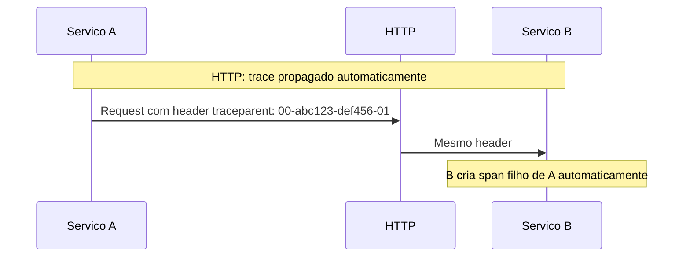
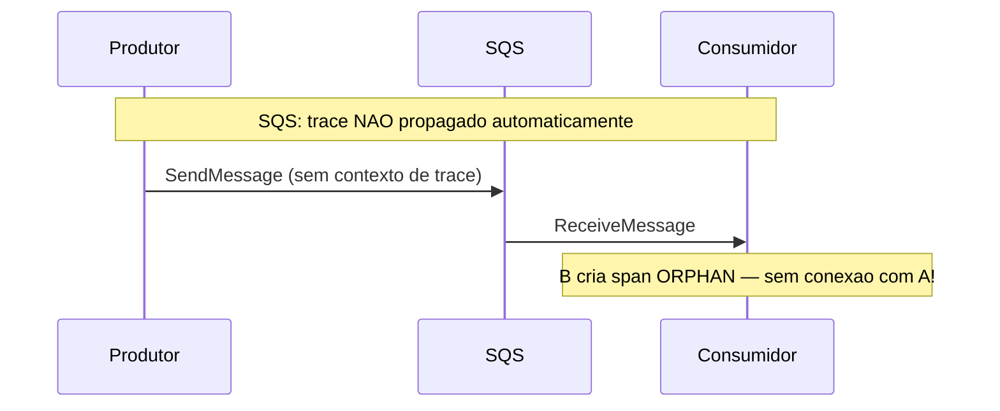
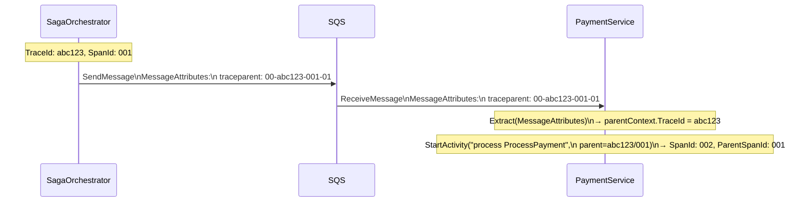
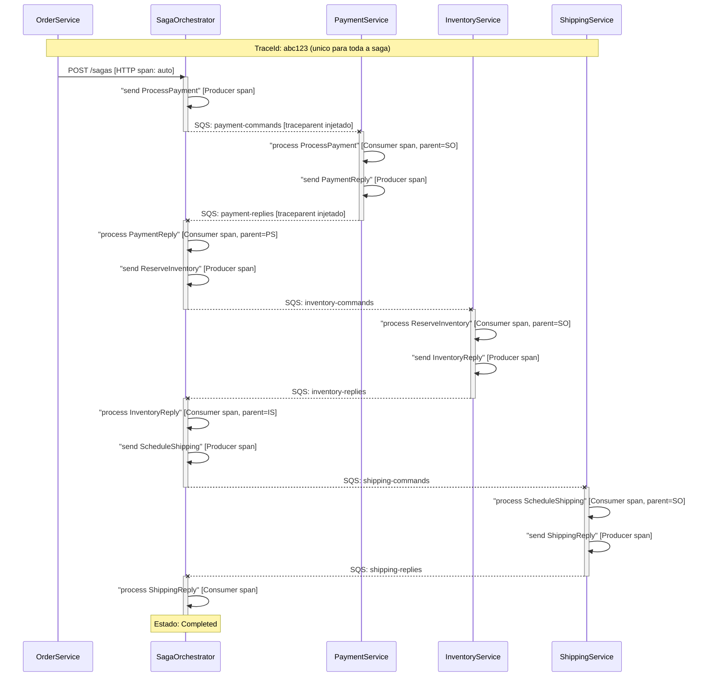

# OpenTelemetry e Traces Distribuidos

## O que e Observabilidade?

**Observabilidade** e a capacidade de entender o estado interno de um sistema a partir de suas saidas externas. Em microservicos, sem observabilidade voce esta "voando as cegas".

### Os tres pilares

| Pilar | O que captura | Ferramenta tipica | Pergunta que responde |
|-------|---------------|-------------------|-----------------------|
| **Logs** | Eventos discretos com contexto | Serilog, Elasticsearch | "O que aconteceu?" |
| **Metricas** | Valores numericos ao longo do tempo | Prometheus, Grafana | "Qual e a saude do sistema?" |
| **Traces** | Caminho de uma requisicao entre servicos | Jaeger, Zipkin, Tempo | "Por que esta lento? Onde falhou?" |

Para sagas distribuidas, **traces** sao o pilar mais critico: uma unica saga pode atravessar 5 servicos e 8 filas. Sem traces, correlacionar logs manualmente e quase impossivel.

---

## OpenTelemetry: O Padrao Aberto

O **OpenTelemetry** (OTel) e um projeto de codigo aberto da CNCF que padroniza como coletar e exportar dados de observabilidade. Ele substitui vendors proprietarios como Jaeger SDK, Zipkin SDK, etc.

### Conceitos fundamentais

```
TraceId: identificador unico da requisicao inteira (atravessa todos os servicos)
    └─ Span: unidade de trabalho com duracao
        └─ SpanId: identificador do span
        └─ ParentSpanId: quem criou este span (forma a arvore)
        └─ Attributes/Tags: metadados (saga.id, http.method, etc.)
        └─ Events: momentos especificos dentro do span
```

Em .NET, Spans sao representados como `System.Diagnostics.Activity` — a API nativa do .NET para tracing.

### Por que OTel e nao SDK do Jaeger diretamente?

Com OpenTelemetry:
- Voce escreve o codigo de instrumentacao **uma vez**
- Escolhe o **exporter** (Jaeger, Zipkin, Grafana Tempo, Datadog) sem mudar o codigo
- Padroes abertos (W3C TraceContext) funcionam entre linguagens e plataformas

---

## O Desafio: Traces sobre Mensageria

HTTP propaga o trace context **automaticamente** via headers (`traceparent`, `tracestate`). Mas o SQS nao tem esse conceito nativo.





Sem propagacao manual, cada servico teria seu proprio trace desconectado. Seria impossivel ver o fluxo completo de uma saga.

---

## W3C TraceContext sobre SQS

A solucao e **injetar** o contexto de trace nos `MessageAttributes` do SQS ao produzir, e **extrair** ao consumir.

### Padrao W3C TraceContext

O W3C define dois headers para propagacao:
- `traceparent`: `{version}-{traceId}-{spanId}-{flags}` — ex: `00-4bf92f3577b34da6a3ce929d0e0e4736-00f067aa0ba902b7-01`
- `tracestate`: informacoes adicionais de vendors (opcional)

### SqsTracePropagation.cs

```csharp
public static class SqsTracePropagation
{
    private static readonly TextMapPropagator Propagator = Propagators.DefaultTextMapPropagator;

    // Produtor: injeta traceparent/tracestate nos MessageAttributes
    public static void Inject(IDictionary<string, MessageAttributeValue> attributes)
    {
        Propagator.Inject(
            new PropagationContext(Activity.Current?.Context ?? default, Baggage.Current),
            attributes,
            (attrs, key, value) => attrs[key] = new MessageAttributeValue
            {
                DataType = "String",
                StringValue = value
            });
    }

    // Consumidor: extrai o contexto dos MessageAttributes
    public static PropagationContext Extract(IDictionary<string, MessageAttributeValue> attributes)
    {
        return Propagator.Extract(
            default,
            attributes,
            (attrs, key) =>
            {
                if (attrs.TryGetValue(key, out var attr) && attr.DataType == "String")
                    return [attr.StringValue];
                return [];
            });
    }
}
```

### Como a propagacao conecta os servicos



Resultado: o trace do PaymentService e **filho** do span do Orchestrator — mesmo `TraceId`, ligados na arvore.

---

## SagaActivitySource: Factory de Spans Padronizados

Para garantir nomes e tags consistentes em todos os servicos, o projeto centraliza a criacao de spans em `SagaActivitySource`:

```csharp
public static class SagaActivitySource
{
    public const string Name = "SagaOrchestration";
    public static readonly ActivitySource Source = new(Name);

    // Produtor: quando o orquestrador envia um comando
    public static Activity? StartSendCommand(string commandType, string sagaId)
    {
        var activity = Source.StartActivity($"send {commandType}", ActivityKind.Producer);
        activity?.SetTag("saga.id", sagaId);
        activity?.SetTag("saga.command_type", commandType);
        activity?.SetTag("messaging.system", "aws_sqs");
        activity?.SetTag("messaging.operation", "publish");
        return activity;
    }

    // Consumidor: quando um worker processa um comando (com parent context extraido do SQS)
    public static Activity? StartProcessCommand(string commandType, string sagaId, ActivityContext parentContext)
    {
        return Source.StartActivity(
            $"process {commandType}",
            ActivityKind.Consumer,
            parentContext);  // <-- conecta ao trace do produtor
        // ... tags
    }

    // Produtor: quando um worker envia um reply
    public static Activity? StartSendReply(string replyType, string sagaId) { ... }

    // Consumidor: quando o orquestrador processa um reply (inclui saga.state)
    public static Activity? StartProcessReply(string replyType, string sagaId, string sagaState, ActivityContext parentContext)
    {
        var activity = Source.StartActivity($"process {replyType}", ActivityKind.Consumer, parentContext);
        activity?.SetTag("saga.state", sagaState);  // estado atual da saga no momento do processamento
        // ...
    }
}
```

### Tags padronizadas em todos os spans

| Tag | Descricao | Exemplo |
|-----|-----------|---------|
| `saga.id` | ID unico da saga | `550e8400-e29b-41d4-...` |
| `saga.command_type` | Tipo do comando | `ProcessPayment` |
| `saga.reply_type` | Tipo do reply | `PaymentReply` |
| `saga.state` | Estado da saga ao processar | `PaymentProcessing` |
| `messaging.system` | Sistema de mensageria | `aws_sqs` |
| `messaging.operation` | Tipo de operacao | `publish` ou `process` |

---

## Configuracao com AddSagaTracing

Todos os servicos registram o OTel com um unico metodo de extensao:

```csharp
// ServiceCollectionExtensions.cs
public static IServiceCollection AddSagaTracing(this IServiceCollection services, string serviceName)
{
    services.AddOpenTelemetry()
        .WithTracing(builder =>
        {
            builder
                .AddSource(SagaActivitySource.Name)          // ouve a ActivitySource "SagaOrchestration"
                .SetResourceBuilder(
                    ResourceBuilder.CreateDefault()
                        .AddService(serviceName))             // identifica o servico (ex: "PaymentService")
                .AddAspNetCoreInstrumentation()              // instrumenta endpoints HTTP automaticamente
                .AddHttpClientInstrumentation()              // instrumenta chamadas HTTP de saida
                .AddConsoleExporter();                       // exibe spans no stdout (desenvolvimento)

            // OTLP exporter: ativado se variavel de ambiente estiver configurada
            var otlpEndpoint = Environment.GetEnvironmentVariable("OTEL_EXPORTER_OTLP_ENDPOINT");
            if (!string.IsNullOrEmpty(otlpEndpoint))
                builder.AddOtlpExporter();
        });

    return services;
}
```

Usado em cada servico:

```csharp
// OrderService/Program.cs
builder.Services.AddSagaTracing("OrderService");

// SagaOrchestrator/Program.cs
builder.Services.AddSagaTracing("SagaOrchestrator");

// PaymentService/Program.cs
builder.Services.AddSagaTracing("PaymentService");
// ... e assim por diante
```

---

## Trace Completo de uma Saga (Happy Path)



No Jaeger ou Grafana Tempo, essa arvore de spans aparece como uma unica timeline visual conectada, permitindo ver o tempo gasto em cada etapa.

---

## Exporters: Console vs OTLP

### Console Exporter (desenvolvimento)

Sempre ativado. Exibe spans no stdout dos containers:

```bash
docker compose logs saga-orchestrator | grep "Activity"
```

Saida tipica:
```
Activity.TraceId:          abc123def456...
Activity.SpanId:           00f067aa0ba9...
Activity.ParentSpanId:     4bf92f3577b3...
Activity.DisplayName:      send ProcessPayment
Activity.Kind:             Producer
Activity.StartTime:        2026-03-31T10:00:00.000Z
Activity.Duration:         00:00:00.012
Activity.Tags:
    saga.id: 550e8400-...
    saga.command_type: ProcessPayment
    messaging.system: aws_sqs
```

### OTLP Exporter (producao / visualizacao)

Para visualizar traces em uma UI, configure `OTEL_EXPORTER_OTLP_ENDPOINT` no `docker-compose.yml`:

```yaml
# Adicionar Jaeger ao docker-compose.yml
jaeger:
  image: jaegertracing/all-in-one:latest
  ports:
    - "16686:16686"  # UI
    - "4317:4317"    # OTLP gRPC

# Em cada servico:
environment:
  OTEL_EXPORTER_OTLP_ENDPOINT: "http://jaeger:4317"
```

Com Jaeger rodando, acesse `http://localhost:16686` para ver todos os traces visualmente.

---

## Proxima Leitura

- [07 - Concorrencia entre Sagas](./07-concorrencia-sagas.md)
- [08 - Guia Pratico](./08-guia-pratico.md)
