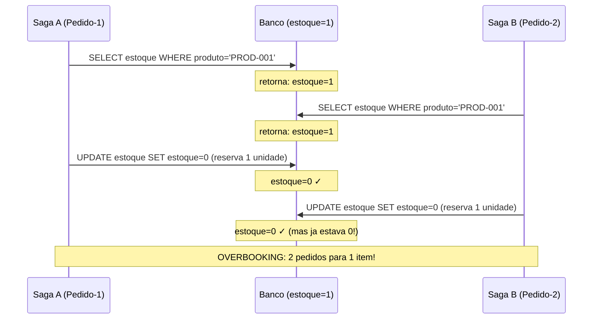
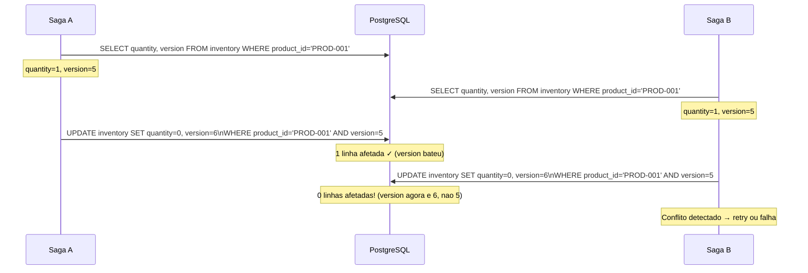
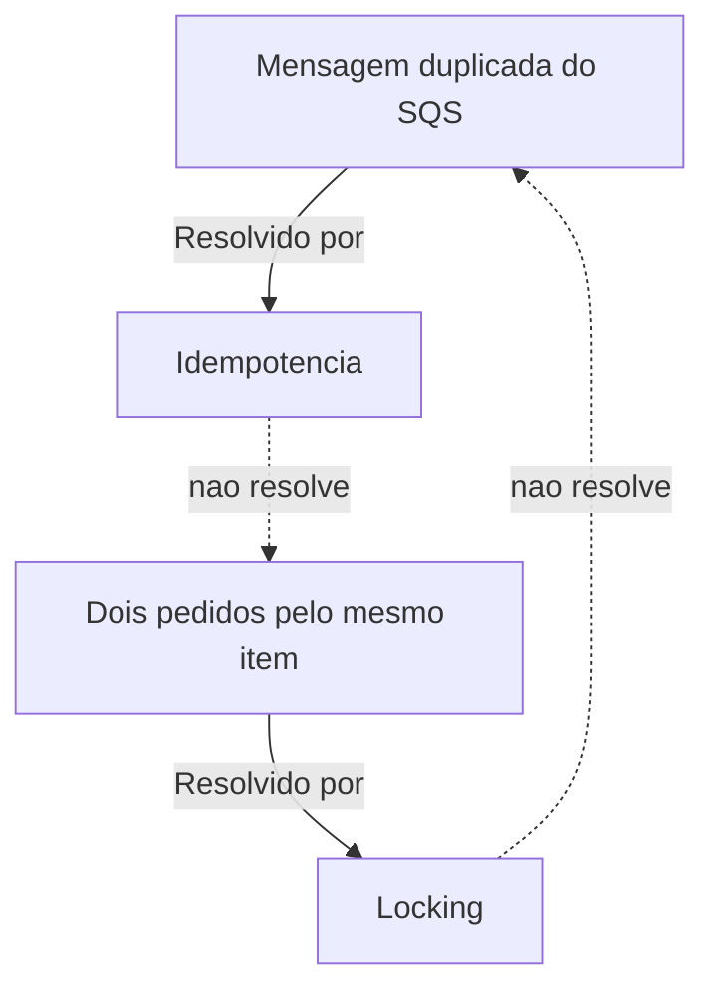

# Concorrencia entre Sagas

> **Nota:** Este documento e majoritariamente teorico. A implementacao pratica de locking esta planejada para o **Milestone M5**. Os conceitos aqui descritos fundamentam as decisoes de design que serao implementadas.

---

## O Problema da Concorrencia

Em um sistema de e-commerce real, multiplas sagas podem executar simultaneamente. A maioria das vezes isso e desejavel — mais pedidos processados em paralelo. Mas quando duas sagas disputam o **mesmo recurso compartilhado**, surgem problemas.

### Cenario: ultimo item em estoque

Imagine que existe apenas **1 unidade** do produto `PROD-001` no estoque.

Dois clientes fazem pedidos quase simultaneamente:



Esse problema classico chama-se **race condition** ou **TOCTOU (Time-Of-Check Time-Of-Use)**: o estado verificado no momento da leitura nao e mais valido no momento da escrita.

---

## Por que Idempotencia Nao Resolve Isso

A idempotencia (ver [04 - Idempotencia e Retry](./04-idempotencia-retry.md)) protege contra **duplicatas da mesma operacao**. Ela nao protege contra **duas operacoes distintas competindo pelo mesmo recurso**.

| Problema | Solucao |
|----------|---------|
| Mesma mensagem entregue duas vezes | Idempotencia |
| Dois pedidos diferentes para o mesmo produto | Locking (pessimista ou otimista) |

---

## Estrategia 1: Pessimistic Locking

O **locking pessimista** assume que conflitos acontecerao e bloqueia o recurso preventivamente.

### Como funciona: SELECT FOR UPDATE

```sql
-- Saga A inicia transacao
BEGIN;
SELECT * FROM inventory WHERE product_id = 'PROD-001' FOR UPDATE;
-- Saga A agora tem o lock exclusivo da linha

-- Saga B tenta acessar o mesmo produto
BEGIN;
SELECT * FROM inventory WHERE product_id = 'PROD-001' FOR UPDATE;
-- Saga B BLOQUEIA aqui, esperando Saga A liberar
```


### Pros e Contras

| Aspecto | Avaliacao |
|---------|-----------|
| **Simplicidade** | Alta — uma linha de SQL resolve |
| **Seguranca** | Maxima — conflito impossivel |
| **Throughput** | Reduzido — servicos esperam uns pelos outros |
| **Risco de deadlock** | Presente se multiplos locks em ordens diferentes |
| **Latencia** | Aumenta sob concorrencia alta |

### Implementacao planejada (M5)

```csharp
// InventoryService/Worker.cs (M5)
private async Task HandleReserveInventoryAsync(ReserveInventory command, CancellationToken ct)
{
    await using var conn = new NpgsqlConnection(_connectionString);
    await conn.OpenAsync(ct);
    await using var tx = await conn.BeginTransactionAsync(ct);

    // Lock pessimista: bloqueia a linha durante a transacao
    var stock = await conn.QuerySingleOrDefaultAsync<int>(
        "SELECT quantity FROM inventory WHERE product_id = @productId FOR UPDATE",
        new { command.ProductId },
        transaction: tx);

    if (stock < command.Quantity)
    {
        await tx.RollbackAsync(ct);
        return new InventoryReply { Success = false, ErrorMessage = "Estoque insuficiente" };
    }

    await conn.ExecuteAsync(
        "UPDATE inventory SET quantity = quantity - @qty WHERE product_id = @productId",
        new { qty = command.Quantity, command.ProductId },
        transaction: tx);

    await tx.CommitAsync(ct);
    return new InventoryReply { Success = true, ReservationId = Guid.NewGuid().ToString() };
}
```

---

## Estrategia 2: Optimistic Locking

O **locking otimista** assume que conflitos sao raros e verifica a consistencia apenas no momento da escrita.

### Como funciona: Version Column

```sql
-- Schema com coluna de versao
ALTER TABLE inventory ADD COLUMN version INTEGER NOT NULL DEFAULT 0;
```



### Pros e Contras

| Aspecto | Avaliacao |
|---------|-----------|
| **Throughput** | Alto — sem bloqueios |
| **Latencia** | Baixa em cenarios de baixa concorrencia |
| **Complexidade** | Media — logica de retry necessaria |
| **Risco de deadlock** | Zero |
| **Comportamento sob alta concorrencia** | Degradacao: muitos retries |
| **Seguranca** | Alta — conflito detectado e tratado |

---

## Comparacao: Pessimistic vs Optimistic

| Criterio | Pessimistic | Optimistic |
|----------|-------------|------------|
| **Mecanismo** | Lock antes de ler | Verificar versao ao escrever |
| **Conflitos evitados** | Preventivamente | Detectados e tratados |
| **Throughput** | Menor | Maior |
| **Latencia media** | Maior | Menor |
| **Risco de deadlock** | Sim | Nao |
| **Logica de retry** | Nao necessaria | Necessaria |
| **Melhor para** | Alta probabilidade de conflito | Baixa probabilidade de conflito |
| **Implementacao** | `SELECT FOR UPDATE` | Coluna `version` + verificacao |

### Quando usar cada um?

- **Pessimistic:** recursos altamente disputados, ex: assentos em shows, ultimas unidades de produto popular
- **Optimistic:** recursos raramente disputados, ex: perfil de usuario, configuracoes de conta

---

## Idempotencia como Complemento

Mesmo com locking, a idempotencia continua sendo necessaria. As duas estrategias resolvem problemas **diferentes e complementares**:



Um sistema robusto precisa de **ambos**:
1. Idempotencia: protege contra replay de mensagens
2. Locking: protege contra conflitos entre sagas distintas

---

## Outras Estrategias de Resolucao

### Queue-per-resource

Criar filas SQS separadas por recurso (ex: uma fila por produto). Como SQS processa mensagens em ordem dentro de uma fila FIFO, pedidos para o mesmo produto sao serializados naturalmente.

```
product-PROD-001-queue → processa pedidos do PROD-001 em sequencia
product-PROD-002-queue → processa pedidos do PROD-002 em sequencia
```

**Pro:** simples, sem locks
**Contra:** numero de filas cresce com o catalogo, gerenciamento complexo

### Advisory Locks no PostgreSQL

PostgreSQL tem mecanismo de locks consultivos (advisory locks) que nao estao vinculados a linhas especificas:

```sql
-- Adquirir lock para o produto (numero unico baseado no productId)
SELECT pg_advisory_xact_lock(hashtext('PROD-001'));
-- Processar...
-- Lock liberado automaticamente ao final da transacao
```

**Pro:** flexivel, nao requer schema especifico
**Contra:** requer mapeamento de recursos para numeros inteiros

---

## Proximos Passos: Milestone M5

O Milestone M5 implementara concorrencia de forma pratica:

**resource-locking:**
- Adicionar `SELECT ... FOR UPDATE` no InventoryService
- Demonstrar race condition **sem** lock (cenario antes)
- Demonstrar serializacao **com** lock (cenario depois)

**concurrent-saga-demo:**
- Script que dispara N pedidos simultaneos para o mesmo produto
- Logs mostrando a ordem de execucao
- Cenario onde estoque e insuficiente para todos — compensacoes parciais

```bash
# Exemplo do script de teste M5
for i in {1..5}; do
  curl -X POST http://localhost:5001/orders \
    -H "Content-Type: application/json" \
    -d '{"productId": "PROD-001", "quantity": 1, "price": 99.90}' &
done
wait
```

Com estoque inicial de 2 e 5 pedidos simultaneos, espera-se:
- 2 sagas chegando ao estado `Completed`
- 3 sagas passando por compensacao ate `Failed`

---

## Proxima Leitura

- [08 - Guia Pratico](./08-guia-pratico.md)
- [01 - Fundamentos de Sagas](./01-fundamentos-sagas.md) (revisao)
