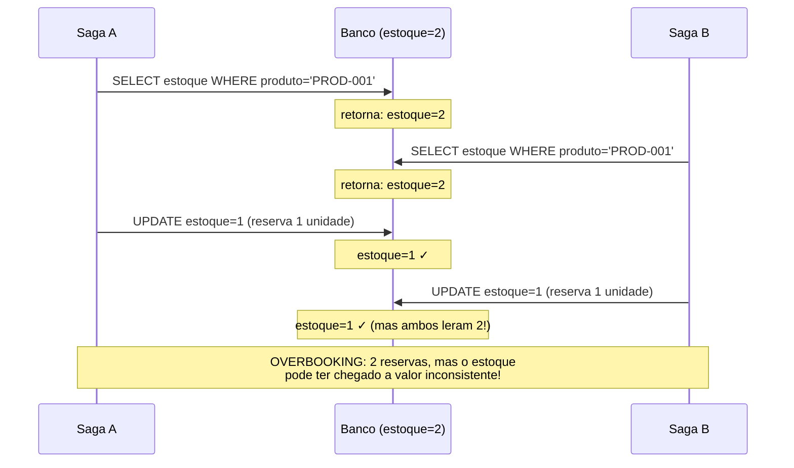
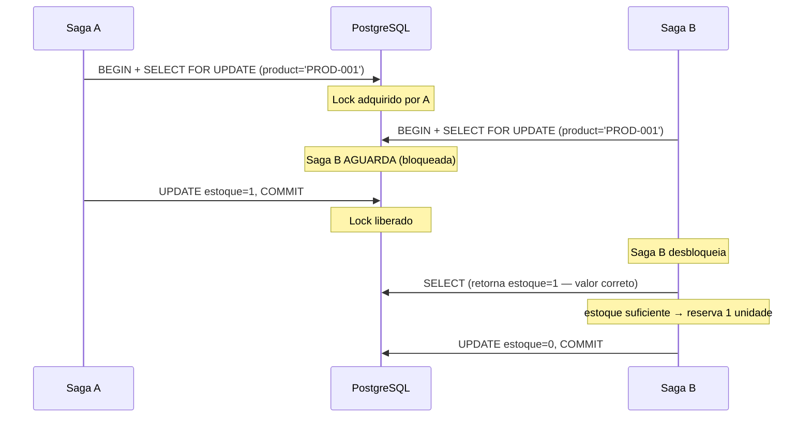
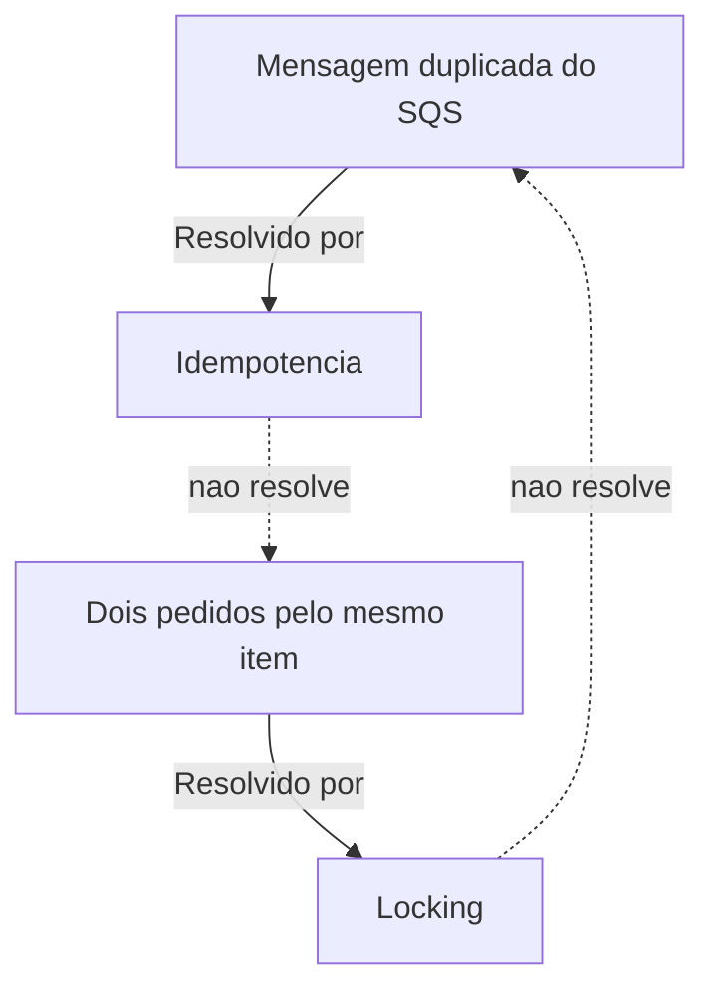

# Concorrencia entre Sagas

> **Status M5:** Implementado. Este documento cobre tanto os conceitos quanto a implementacao real no `InventoryService`.

---

## O Problema da Concorrencia

Em um sistema de e-commerce real, multiplas sagas podem executar simultaneamente. A maioria das vezes isso e desejavel — mais pedidos processados em paralelo. Mas quando duas sagas disputam o **mesmo recurso compartilhado**, surgem problemas.

### Cenario: ultimas unidades em estoque

Imagine que existe apenas **2 unidades** do produto `PROD-001` no estoque e 5 clientes fazem pedidos quase simultaneamente:



Esse problema classico chama-se **race condition** ou **TOCTOU (Time-Of-Check Time-Of-Use)**: o estado verificado no momento da leitura nao e mais valido no momento da escrita.

---

## Por que Idempotencia Nao Resolve Isso

A idempotencia (ver [04 - Idempotencia e Retry](./04-idempotencia-retry.md)) protege contra **duplicatas da mesma operacao**. Ela nao protege contra **duas operacoes distintas competindo pelo mesmo recurso**.

| Problema | Solucao |
|----------|---------|
| Mesma mensagem entregue duas vezes | Idempotencia |
| Dois pedidos diferentes para o mesmo produto | Locking (pessimista ou otimista) |

---

## Estrategia 1: Pessimistic Locking (implementado no M5)

O **locking pessimista** assume que conflitos acontecerao e bloqueia o recurso preventivamente.

### Como funciona: SELECT FOR UPDATE

```sql
-- Saga A inicia transacao
BEGIN;
SELECT quantity FROM inventory WHERE product_id = 'PROD-001' FOR UPDATE;
-- Saga A agora tem o lock exclusivo da linha

-- Saga B tenta acessar o mesmo produto
BEGIN;
SELECT quantity FROM inventory WHERE product_id = 'PROD-001' FOR UPDATE;
-- Saga B BLOQUEIA aqui, esperando Saga A liberar
```



### Implementacao real: InventoryRepository

O `InventoryRepository` (Npgsql direto, sem EF Core) implementa o locking pessimista:

```csharp
// src/InventoryService/InventoryRepository.cs
public async Task<(bool Success, string? ErrorMessage)> TryReserveAsync(
    string productId, int quantity, string reservationId, Guid sagaId,
    bool useLock, CancellationToken ct = default)
{
    await using var conn = new NpgsqlConnection(_connectionString);
    await conn.OpenAsync(ct);
    await using var tx = await conn.BeginTransactionAsync(ct);

    // Leitura com ou sem lock pessimista — controlado por useLock
    var sql = useLock
        ? "SELECT quantity FROM inventory WHERE product_id = @productId FOR UPDATE"
        : "SELECT quantity FROM inventory WHERE product_id = @productId";

    await using var selectCmd = conn.CreateCommand();
    selectCmd.Transaction = tx;
    selectCmd.CommandText = sql;
    selectCmd.Parameters.AddWithValue("productId", productId);

    var currentStock = (int?)await selectCmd.ExecuteScalarAsync(ct);

    if (!useLock)
    {
        // Simula janela TOCTOU para tornar a race condition visivel
        // em processamento paralelo de mensagens
        await Task.Delay(150, ct);
    }

    if (currentStock < quantity)
    {
        await tx.RollbackAsync(ct);
        return (false, $"Estoque insuficiente: disponivel={currentStock}, solicitado={quantity}");
    }

    // Decrementar estoque e registrar reserva atomicamente
    await using var updateCmd = conn.CreateCommand();
    updateCmd.Transaction = tx;
    updateCmd.CommandText = "UPDATE inventory SET quantity = quantity - @qty WHERE product_id = @productId";
    updateCmd.Parameters.AddWithValue("qty", quantity);
    updateCmd.Parameters.AddWithValue("productId", productId);
    await updateCmd.ExecuteNonQueryAsync(ct);

    await using var insertCmd = conn.CreateCommand();
    insertCmd.Transaction = tx;
    insertCmd.CommandText = """
        INSERT INTO inventory_reservations (reservation_id, product_id, quantity, saga_id)
        VALUES (@reservationId, @productId, @quantity, @sagaId)
        """;
    insertCmd.Parameters.AddWithValue("reservationId", reservationId);
    insertCmd.Parameters.AddWithValue("productId", productId);
    insertCmd.Parameters.AddWithValue("quantity", quantity);
    insertCmd.Parameters.AddWithValue("sagaId", sagaId);
    await insertCmd.ExecuteNonQueryAsync(ct);

    await tx.CommitAsync(ct);
    return (true, null);
}
```

### Schema do banco

```sql
-- Tabela de produtos com estoque
CREATE TABLE inventory (
    product_id  VARCHAR(100) PRIMARY KEY,
    name        VARCHAR(255) NOT NULL,
    quantity    INTEGER NOT NULL DEFAULT 0
);

-- Tabela de reservas ativas (usada na compensacao)
CREATE TABLE inventory_reservations (
    reservation_id  VARCHAR(256) PRIMARY KEY,
    product_id      VARCHAR(100) NOT NULL REFERENCES inventory(product_id),
    quantity        INTEGER NOT NULL,
    saga_id         UUID NOT NULL,
    reserved_at     TIMESTAMP NOT NULL DEFAULT NOW()
);

-- Produto de demo criado no startup do InventoryService
INSERT INTO inventory (product_id, name, quantity)
VALUES ('PROD-001', 'Produto Demo Concorrencia', 2)
ON CONFLICT (product_id) DO NOTHING;
```

### Pros e Contras

| Aspecto | Avaliacao |
|---------|-----------|
| **Simplicidade** | Alta — uma linha de SQL resolve |
| **Seguranca** | Maxima — conflito impossivel |
| **Throughput** | Reduzido — servicos esperam uns pelos outros |
| **Risco de deadlock** | Presente se multiplos locks em ordens diferentes |
| **Latencia** | Aumenta sob concorrencia alta |

---

## Estrategia 2: Optimistic Locking

O **locking otimista** assume que conflitos sao raros e verifica a consistencia apenas no momento da escrita.

### Como funciona: Version Column

```sql
-- Schema com coluna de versao
ALTER TABLE inventory ADD COLUMN version INTEGER NOT NULL DEFAULT 0;
```


| Aspecto | Avaliacao |
|---------|-----------|
| **Throughput** | Alto — sem bloqueios |
| **Latencia** | Baixa em cenarios de baixa concorrencia |
| **Complexidade** | Media — logica de retry necessaria |
| **Risco de deadlock** | Zero |
| **Comportamento sob alta concorrencia** | Degradacao: muitos retries |

---

## Comparacao: Pessimistic vs Optimistic

| Criterio | Pessimistic | Optimistic |
|----------|-------------|------------|
| **Mecanismo** | Lock antes de ler | Verificar versao ao escrever |
| **Conflitos evitados** | Preventivamente | Detectados e tratados |
| **Throughput** | Menor | Maior |
| **Latencia media** | Maior | Menor |
| **Risco de deadlock** | Sim | Nao |
| **Logica de retry** | Nao necessaria | Necessaria |
| **Melhor para** | Alta probabilidade de conflito | Baixa probabilidade de conflito |
| **Implementacao** | `SELECT FOR UPDATE` | Coluna `version` + verificacao |

---

## Idempotencia como Complemento

Mesmo com locking, a idempotencia continua sendo necessaria. As duas estrategias resolvem problemas **diferentes e complementares**:



Um sistema robusto precisa de **ambos**:
1. Idempotencia: protege contra replay de mensagens
2. Locking: protege contra conflitos entre sagas distintas

---

## Outras Estrategias de Resolucao

### Queue-per-resource

Criar filas SQS separadas por recurso (ex: uma fila por produto). Como SQS processa mensagens em ordem dentro de uma fila FIFO, pedidos para o mesmo produto sao serializados naturalmente.

```
product-PROD-001-queue → processa pedidos do PROD-001 em sequencia
product-PROD-002-queue → processa pedidos do PROD-002 em sequencia
```

**Pro:** simples, sem locks
**Contra:** numero de filas cresce com o catalogo, gerenciamento complexo

### Advisory Locks no PostgreSQL

PostgreSQL tem mecanismo de locks consultivos (advisory locks) que nao estao vinculados a linhas especificas:

```sql
SELECT pg_advisory_xact_lock(hashtext('PROD-001'));
-- Processar...
-- Lock liberado automaticamente ao final da transacao
```

**Pro:** flexivel, nao requer schema especifico
**Contra:** requer mapeamento de recursos para numeros inteiros

---

## Demo Pratico: M5 concurrent-saga-demo

### Configuracao

O comportamento de locking e controlado pela variavel de ambiente `INVENTORY_LOCKING_ENABLED`:

```yaml
# docker-compose.yml — inventory-service
environment:
  - INVENTORY_LOCKING_ENABLED=true   # padrao: FOR UPDATE
  # - INVENTORY_LOCKING_ENABLED=false  # para demo de race condition
```

O log de startup do InventoryService confirma o modo ativo:

```
InventoryService worker iniciado — locking=FOR UPDATE (pessimista)
# ou
InventoryService worker iniciado — locking=SEM LOCK (demonstracao de race condition)
```

### Executar o demo

```bash
# Cenario COM lock (padrao): 2 Completed + 3 Failed
bash scripts/concurrent-saga-demo.sh

# Cenario SEM lock: resultado imprevisivel (overbooking possivel)
# 1. Configurar no .env: INVENTORY_LOCKING_ENABLED=false
# 2. Reiniciar o servico: docker compose up -d inventory-service
# 3. Executar:
bash scripts/concurrent-saga-demo.sh --no-lock
```

Parametros do script:

```bash
bash scripts/concurrent-saga-demo.sh \
  --pedidos 5 \    # numero de pedidos simultaneos (padrao: 5)
  --estoque 2      # estoque inicial a resetar (padrao: 2)
```

### Saida esperada COM lock (FOR UPDATE)

```
=== Verificando servicos ===
✓ OrderService: OK
✓ InventoryService: OK
✓ SagaOrchestrator: OK

=== Resetando estoque ===
✓ Estoque de PROD-001 resetado para 2 unidades

=== Disparando 5 pedidos simultaneos para PROD-001 ===

=== Resultado Final ===
✓ Saga 1 (abc-...): Completed
✓ Saga 2 (def-...): Completed
⚠ Saga 3 (ghi-...): Failed (compensacao executada)
⚠ Saga 4 (jkl-...): Failed (compensacao executada)
⚠ Saga 5 (mno-...): Failed (compensacao executada)

--- Resumo ---
Modo:               com lock (FOR UPDATE)
Pedidos disparados: 5
Estoque inicial:    2
Estoque final:      0
Sagas Completed:    2
Sagas Failed:       3

✓ Resultado CORRETO: 2 pedidos aprovados (= estoque disponivel)
✓ FOR UPDATE serializou o acesso — sem overbooking!
```

### Saida esperada SEM lock (race condition)

```
=== Resultado Final ===
✓ Saga 1: Completed
✓ Saga 2: Completed
✓ Saga 3: Completed    ← OVERBOOKING: aprovado mesmo sem estoque!
⚠ Saga 4: Failed
⚠ Saga 5: Failed

--- Resumo ---
Estoque final:      -1   ← estoque NEGATIVO
Sagas Completed:    3    ← mais do que o estoque disponivel (2)!

✗ OVERBOOKING DETECTADO! Estoque = -1 (negativo)
✗ Race condition em acao: multiplas transacoes aprovaram alem do estoque disponivel
```

### Logs do InventoryService (modo COM lock)

```
[Inventory] SELECT FOR UPDATE: produto=PROD-001, estoque_lido=2, solicitado=1
[Inventory] Reserva confirmada: produto=PROD-001, qty=1, reservationId=a1b2...

# Saga A libera o lock. Saga B agora le o estoque atualizado:
[Inventory] SELECT FOR UPDATE: produto=PROD-001, estoque_lido=1, solicitado=1
[Inventory] Reserva confirmada: produto=PROD-001, qty=1, reservationId=c3d4...

# A partir daqui, estoque=0. Todas as demais falham:
[Inventory] SELECT FOR UPDATE: produto=PROD-001, estoque_lido=0, solicitado=1
[Inventory] Estoque insuficiente: produto=PROD-001, disponivel=0, solicitado=1
```

### Logs do InventoryService (modo SEM lock)

```
# Todas as 5 transacoes leem o estoque antes de qualquer UPDATE:
[Inventory] SELECT (sem lock): produto=PROD-001, estoque_lido=2, solicitado=1
[Inventory] SELECT (sem lock): produto=PROD-001, estoque_lido=2, solicitado=1
[Inventory] SELECT (sem lock): produto=PROD-001, estoque_lido=2, solicitado=1
[Inventory] SELECT (sem lock): produto=PROD-001, estoque_lido=2, solicitado=1
[Inventory] SELECT (sem lock): produto=PROD-001, estoque_lido=2, solicitado=1

# Todas 5 veem estoque=2 e prosseguem com UPDATE:
[Inventory] Reserva confirmada: produto=PROD-001, qty=1, reservationId=a1...
[Inventory] Reserva confirmada: produto=PROD-001, qty=1, reservationId=b2...
[Inventory] Reserva confirmada: produto=PROD-001, qty=1, reservationId=c3...
# ... estoque agora pode ser -3 ou qualquer valor incorreto
```

### Verificar estoque atual

```bash
# Checar estoque do PROD-001
curl http://localhost:5004/inventory/stock/PROD-001

# Resetar para demonstracao
curl -X POST http://localhost:5004/inventory/reset \
  -H "Content-Type: application/json" \
  -d '{"productId": "PROD-001", "quantity": 2}'
```

---

## Proxima Leitura

- [08 - Guia Pratico](./08-guia-pratico.md)
- [04 - Idempotencia e Retry](./04-idempotencia-retry.md) (complemento ao locking)
